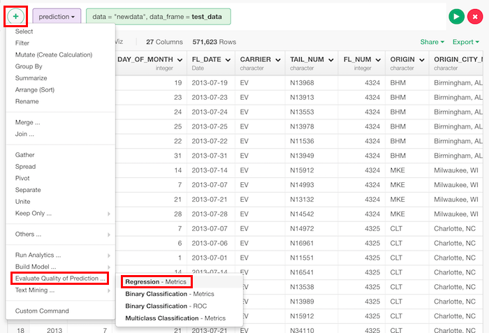
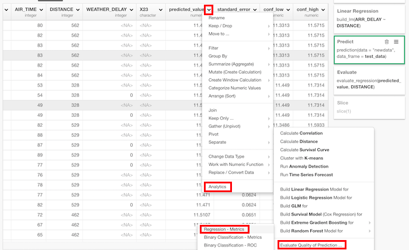
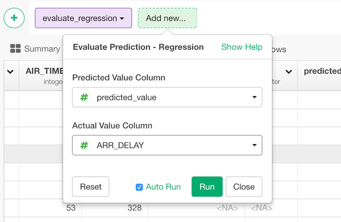

# Evaluate Prediction - Regression

Returns a data frame with evaluation score of regression including the below.

* r_squared
* explained_variance
* mean_square_error
* misclassification_error
* root_mean_square_error
* mean_absolute_error
* mean_absolute_percentage_error

## How to Access This Feature

### From + (plus) Button
There are two ways to access. One is to access from 'Add' (Plus) button.

Another way is to access from a column header menu.

## How to Use?

* Predicted Value Column - The column with predicted values. Usually, it's predicted_value in the framework of Exploratory.
* Actual Value Column - The column with actual value.
