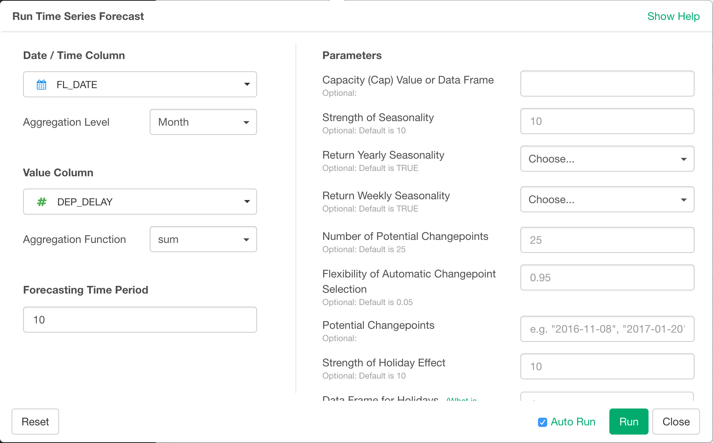
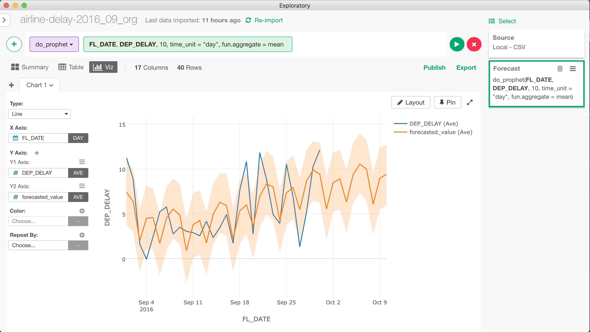

# Time Series Forecasting

With Time Series Forecasting, you can calculate forecast data into the future based on the time series data frame from the past.

## Input Data
Input data should be a time series data frame. It should have following columns.
  * A date/time column with Date or POSIXct data.
  * A value column with numeric values that you want to forecast into the future.

## How to Access This Feature
* Click "+" button and mouse over "Run Analytics ...", and select "Run Time Series Forecast" submenu to open "Run Time Series Forecast" dialog.

## Add forecast data to time series data frame
After "Run Time Series Forecast" dialog is opened, follow the steps below to calculate forecast data.

1. Select date/time column with "Date / Time Column" dropdown. This columns is the time axis along which forecasting is performed.
2. Select aggregation level from "Aggregation Level" dropdown. Input data is aggregated with this time unit. For example, if you select "Day" and there are multiple rows that falls within a same day, the values for those rows are aggregated to form single row for the date. As a result, this becomes the time unit for the resulting time series data frame. Aggregation level can be one of the following.
  * Day
  * Week
  * Month
  * Quarter
  * Year
3. Select value column from "Value Column" dropdown. This is the value of interest that you want to forecast.
4. Select aggregation function from "Aggregation Function" dropdown. This is how the multiple rows that falls under same time period (the one you specified with "Aggregation Level".) is aggregated. Its value can be one of the following.
  * sum
  * mean
  * count
  * median
  * max
  * min
  * first
  * last
  * mad - Median Absolute Deviation
  * sd - Standard Deviation
  * var - Variance
5. Specify the number of time period for which you want to forecast the value of interest in "Forecasting Time Period" text field.

6. (Optional) Specify additional parameters in "Parameters" section.
  * Capacity (Cap) Value or Data Frame
  * Strength of Seasonality
  * Return Yearly Seasonality
  * Return Weekly Seasonality
  * Number of Potential Changepoints
  * Flexibility of Automatic Changepoint Selection
  * Potential Changepoints
  * Strength of Holiday Effect
  * Data Frame for Holidays
  * MCMC Samples for Full Bayesian Inference
  * Width of Uncertainty Intervals
  * Number of Simulations for Uncertainty Intervals

7. Click "Run" button.

## Output Data

## Reference
* [An Introduction to Time Series Forecasting with Prophet Package in Exploratory](https://blog.exploratory.io/an-introduction-to-time-series-forecasting-with-prophet-package-in-exploratory-129ed0c12112)
