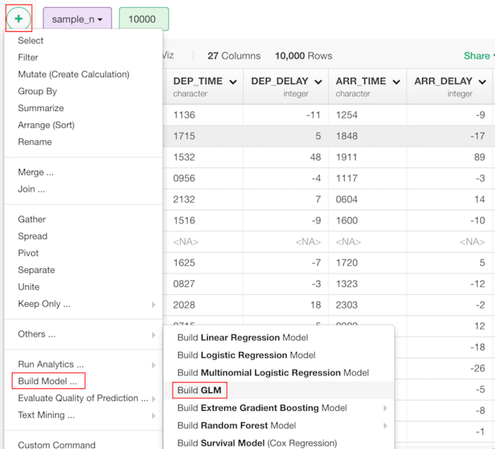
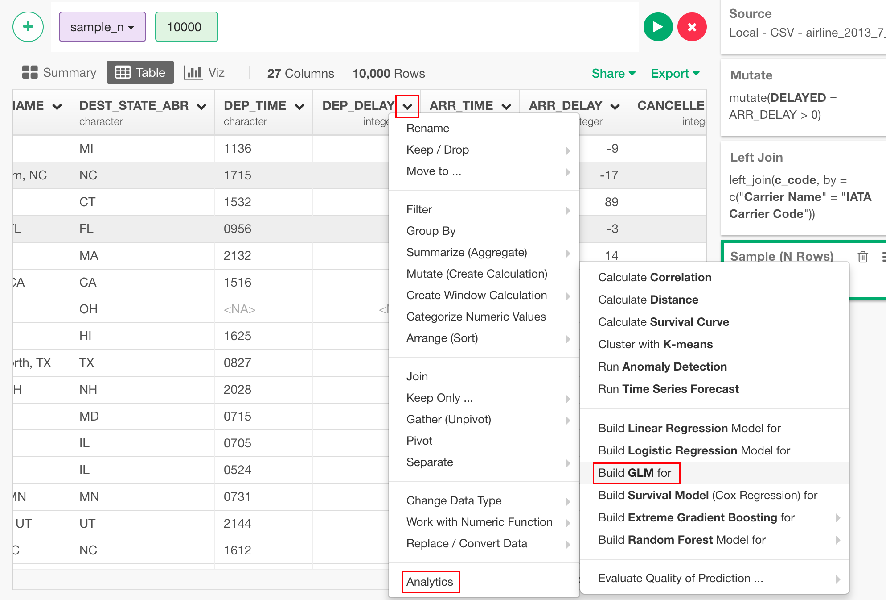
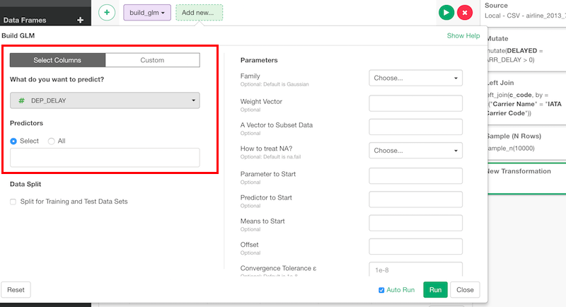
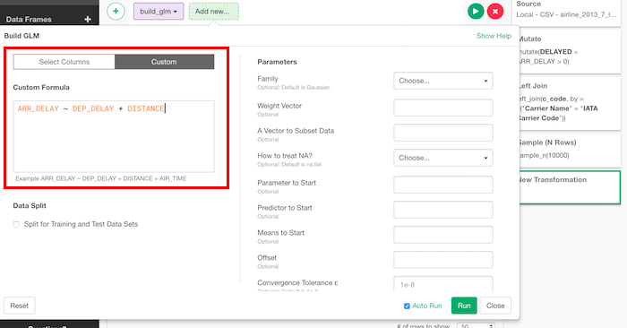
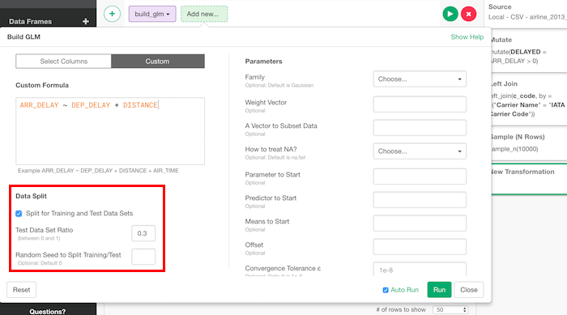
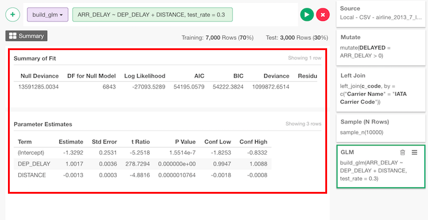

# Generalized Linear Regression Model

## Introduction

Generalized linear regression model is a generalized version of [linear regression](./linear-regression.md) that can be applicable to response variables that have error distribution models other than a normal distribution.

## How to Access?

There are two ways to access. One is to access from 'Add' (Plus) button.

Another way is to access from a column header menu from a numeric column.

## How to Use?

### Column Selection

There are two ways to set what you want to predict by what variables.

If you are on "Select Columns" tab, you can set them by column selector.

If you are on "Custom" tab, you can type a formula directly.

### Train Test Split

You can split the data into training and test to evaluate the performance of the model. You can set

* Test Data Set Ratio - Ratio of test data in the whole data.
* Random Seed to Split Training/Test - You can change random seed to try other training and test data combination.

### Parameters

* Family (Optional) - The default is gaussian. You can use other families listed below.
  * binomial
  * gaussian
  * Gamma
  * inverse.gaussian
  * poisson
  * quasi
  * quasibinomial
  * quasipoisson
* Weight Vector (Optional) - Weights vector.
* A Vector to Subset Data (Optional) - A vector to subset data.
* How to treat NA? (Optional) - The default is "na.fail". This changes the behaviour of NA data. Can be one of the following.
  * "na.omit"
  * "na.fail"
  * "na.exclude"
  * "na.pass"
  * NULL
* Parameter to Start (Optional) - Values of parameters to start.
* Predictor to Start (Optional) - Values of predictors to start.
* Means to Start (Optional) - Means to start.
* Offset (Optional) - Already known components for linear predictors during fitting.
* Convergence Tolerance ε (Optional) - The default is 1e-8. Convergence tolerance ε for fitting.
* Maximum # of Iteration (Optional) - The default is 25. Maximum number of iteration for fitting.
* Generate Result per Iteration (Optional) - The default is FALSE. Whether results should be generated for each iteration.
* Return Model Object (Optional) - The default is TRUE. If model should be returned or not.
* Method to Apply (Optional) - The default is "glm.fit". Fitting method.
* Return Model Matrix X (Optional) - The default is FALSE. If x should be returned.
* Return Model Matrix Y (Optional) - The default is TRUE. If y should be returned.

Take a look at the [reference document](https://stat.ethz.ch/R-manual/R-devel/library/stats/html/glm.html) for the 'glm' function from base R for more details on the parameters.

## How to Read Summary

Once you run it, you will see summary info like this.

### Summary of Fit

* Null Deviance - The deviance for the null model, comparable with deviance. The null model will include the offset, and an intercept if there is one in the model. Note that this will be incorrect if the link function depends on the data other than through the fitted mean: specify a zero offset to force a correct calculation.
* DF for Null Model - The residual degrees of freedom for the null model.
* Log Likelihood - The data's log-likelihood under the model.
* AIC - The Akaike Information Criterion
* BIC - The Bayesian Information Criterion.
* Deviance - Up to a constant, minus twice the maximized log-likelihood. Where sensible, the constant is chosen so that a saturated model has deviance zero.
* Residual DF - Residual degrees of freedom.

### Parameter Estimates

* Term - The term in the model being estimated and tested.
* Estimate - The estimated coefficient.
* Std Error - The standard error from the model.
* t Ratio - t-statistic.
* P Value - Two sided p-value.
* Conf Low - Lower bound of 95% confidence interval.
* Conf High - Upper bound of confidence interval.
