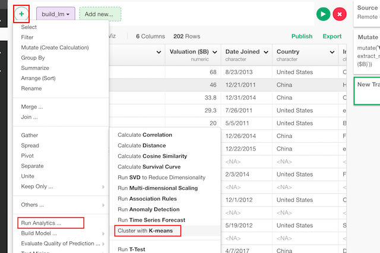
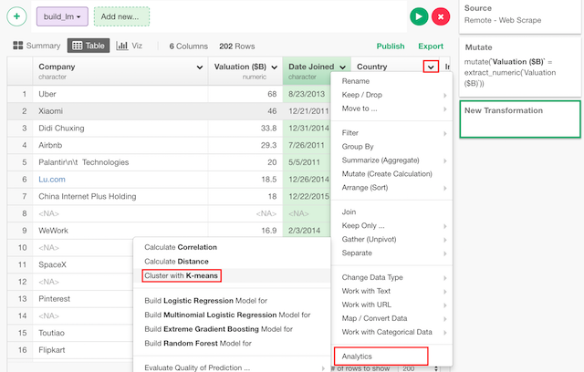
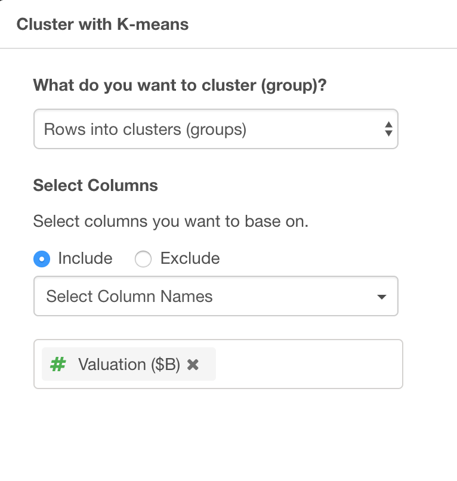
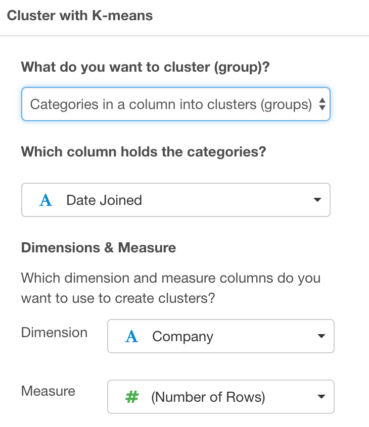
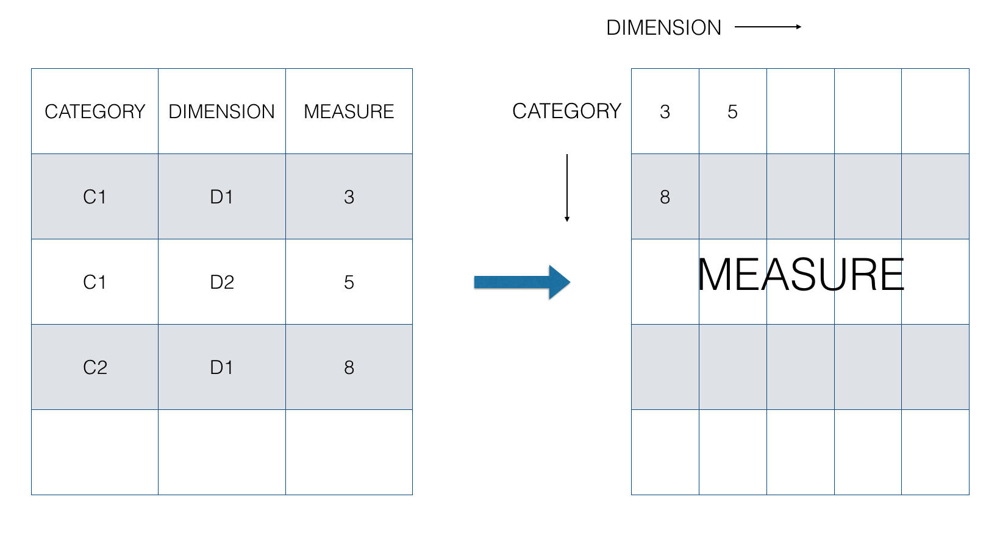

# K-means Clustering Model

## Introduction

Cluster data by K-means algorithm. It assigns labels to data, so that similar data will be in same labels.

## How to Access?

There are two ways to access. One is to access from 'Add' (Plus) button.

Another way is to access from a column header menu.

## How to Use?

### Calculate Cluster by Multiple Columns (Variables)

#### Column Selection

There are many ways to select columns. You can choose
* Select Column Names - Listing up columns selecting one by one
* Range of Column Position - Select columns between columns chosen as Start and End
* Starts with - Select columns whose names start with a certain text
* Ends with - Select columns whose names end with a certain text
* Contains - Select columns whose names contain a certain text.
* Matches Regular Expression - Select columns whose names contain a certain text.
* Range of Suffix (X1, X2...) - Select columns names with prefix and numbers.
* Everything - All columns.
* All Numeric Columns - All numeric columns.

### Cluster Categories

#### Column Selection

Category column is a column that has categories which you want to cluster. Internally, the values in the columns are expanded to a matrix like the figure above. Then, cluster numbers are assigned to each row (category) based on how similar the measures are.

If there are duplicated values or missing values for a cell, they will be aggregated by "Aggregate with" or filled by "Fill with".

### Parameters

* Number of Clusters (Optional) - Set an integer number to decide how many clusters (groups) to build.
* Max Iteration Time (Optional) - The default is 10. The maximum number of cluster update iteration.
* Trial Times (Optional) - The default is 1. This works only when the centers argument is a number. How many random initial configuration should be tried. The best result is chosen as output.
* Algorithm (Optional) - The default is Hartigan-Wong. This can be
  * "Hartigan-Wong"
  * "Lloyd"
  * "Forgy"
  * "MacQueen"
* Random Seed (Optional) - The default is 0. This is random seed. You can change the result if you change this number.

Take a look at the [reference document](https://stat.ethz.ch/R-manual/R-devel/library/stats/html/kmeans.html) for the 'kmeans' function from base R for more details on the parameters.

## Step-by-step

Here's a step-by-step tutorial guide on how you can run K-means Clustering to cluster your data based on multiple columns (or variables) values or cluster ‘categories’ based on given ‘dimension’ and ‘measure’ values.

* [Introduction to K-means Clustering in Exploratory](https://blog.exploratory.io/introduction-to-k-means-clustering-in-exploratory-8352650f1185)
