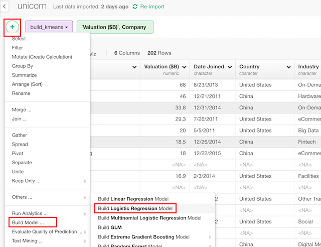
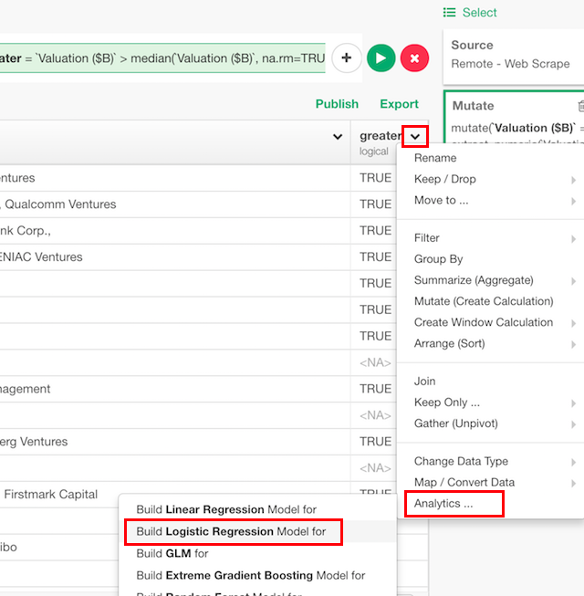

# Logistic Regression Model

## Introduction

Logistic regression model is a statistical model that fits to a explanatory variable that follows binary (0 or 1) distribution with linear predictors.

## How to Access?

There are two ways to access. One is to access from 'Add' (Plus) button.

Another way is to access from a column header menu from a numeric column.

## How to Use?

### Column Selection

There are two ways to set what you want to predict by what variables.

If you are on "Select Columns" tab, you can set them by column selector.

If you are on "Custom" tab, you can type a formula directly.

### Train Test Split

You can split the data into training and test to evaluate the performance of the model. You can set

* Test Data Set Ratio - Ratio of test data in the whole data.
* Random Seed to Split Training/Test - You can change random seed to try other training and test data combination.

### Parameters

* Weight Vector (Optional) - "weights" parameter of glm function.
* A Vector to Subset Data (Optional) - "subset" parameter of glm function.
* How to treat NA? (Optional) - "na.action" parameter of glm. function. The default is "na.fail". This changes the behaviour of NA data. Can be one of the following.
  * "na.omit"
  * "na.fail"
  * "na.exclude"
  * "na.pass"
  * NULL
* Parameter to Start (Optional) - "start" parameter in glm. Starting values for the parameters in the linear predictor.
* Predictor to Start (Optional) - "etastart" parameter in glm. Starting values for the linear predictor.
* Means to Start (Optional) - "mustart" parameter in glm.
* Offset (Optional) - "offset" parameter in glm. This can be used to specify an a priori known component to be included in the linear predictor during fitting.
* Convergence Tolerance ε (Optional) -
"epsilon" parameter in glm. Positive convergence tolerance ε.
* Maximum # of Iteration - "maxit" parameter in glm. Integer giving the maximal number of iterative weighted least squares iterations.
* Generate Result per Iteration - "trace" parameter in glm. Logical indicating if output should be produced for each iteration.
* Return Model Object - "model" paramter in glm. A logical value indicating whether model frame should be included as a component of the returned value.
* Which method to apply? (Optional) - "method" parameter of glm function. The default is "glm.fit". The method to be used in fitting the model. This can be
  * "glm.fit"
  * "model.frame"
* Return Model Matrix X (Optional) - "x" parameter of glm function. If x should be included in the returned value.
* Return Model Matrix Y (Optional) - "y" parameter of glm function. If y should be included in the returned value.

Take a look at the [reference document](https://stat.ethz.ch/R-manual/R-devel/library/stats/html/glm.html) for the 'glm' function from base R for more details on the parameters.

## Step-by-step

Here's a step-by-step tutorial guide on how you can build, predict and evaluate logistic regression model.

* [Introduction to Logistic Regression in Exploratory](https://blog.exploratory.io/quick-introduction-to-logistic-regression-in-exploratory-fdcf321e2d7d)
