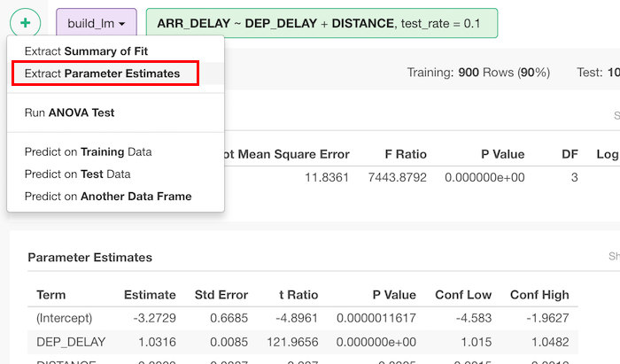
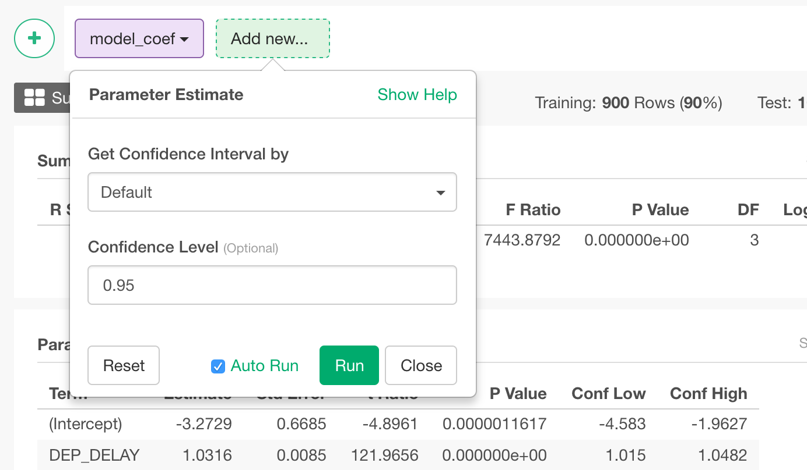

# Extract Parameter Estimates

## How to Access This Feature

### From + (plus) Button
You can access it from 'Add' (Plus) button from model view.

## How to Use?

* Get Confidence Interval by (Optional) - The default is NULL. How to calculate confidence intervals for coefficients. "default" calculates confidence interval by parameters inside model, so this is faster. "profile" uses profiling, so this takes time but better result especially for small number of samples. If NULL, this doesn't return confidence interval. This can be
  * NULL
  * "default"
  * "profile"
* Confidence Level (Optional) - The default is 0.95. Confidence interval level. The larger this parameter, it tries to get wider range so that the true value can be between the values. This is ignored if conf_int is NULL.
