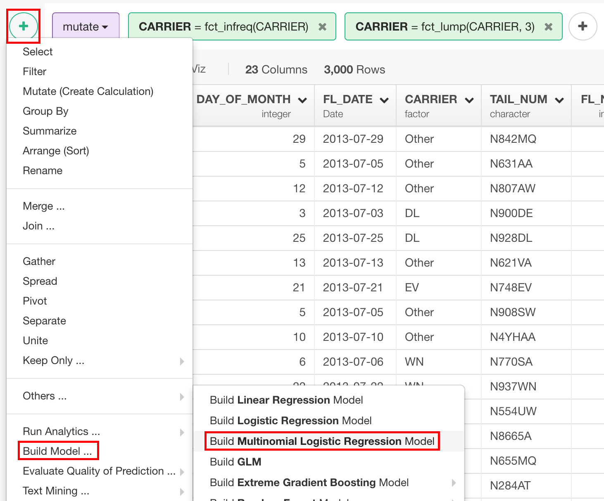
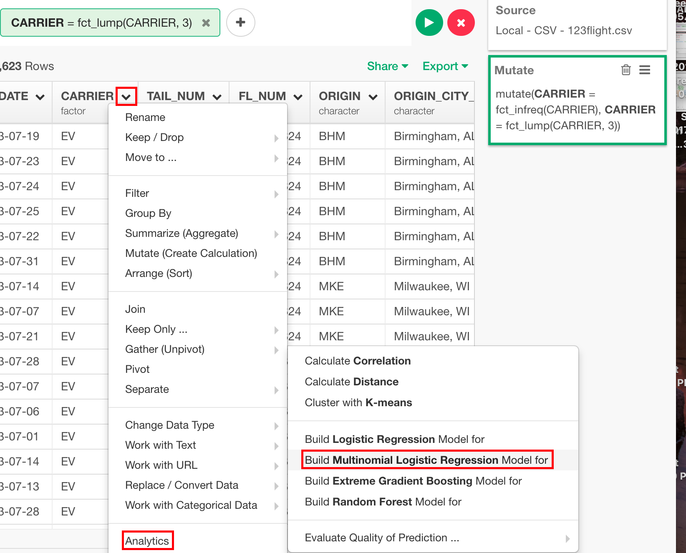
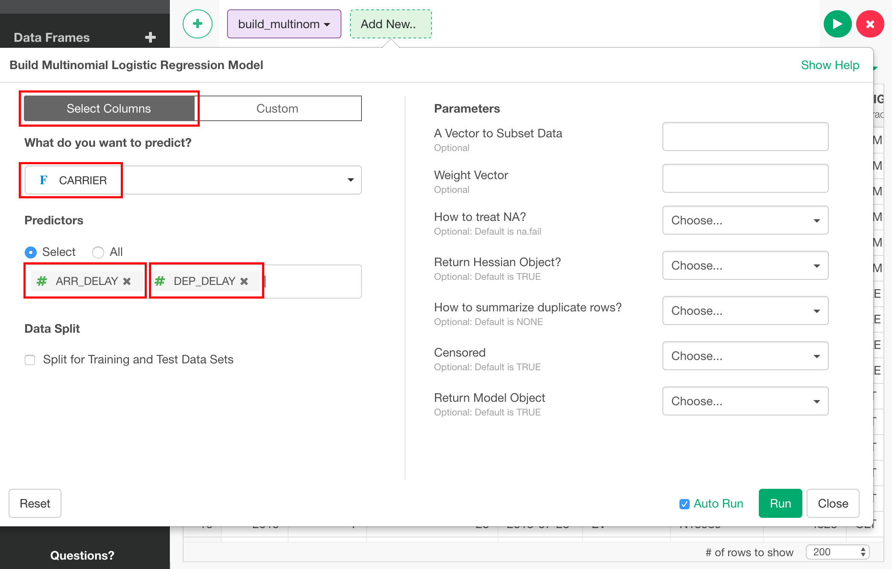
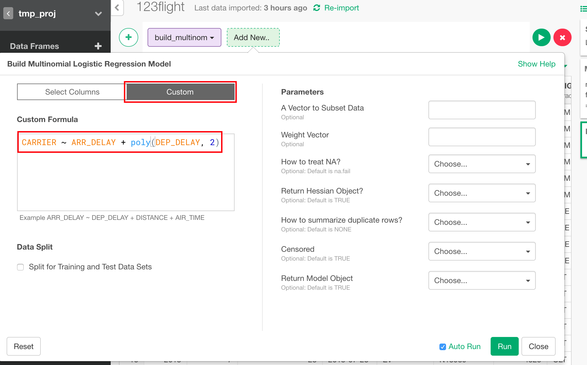
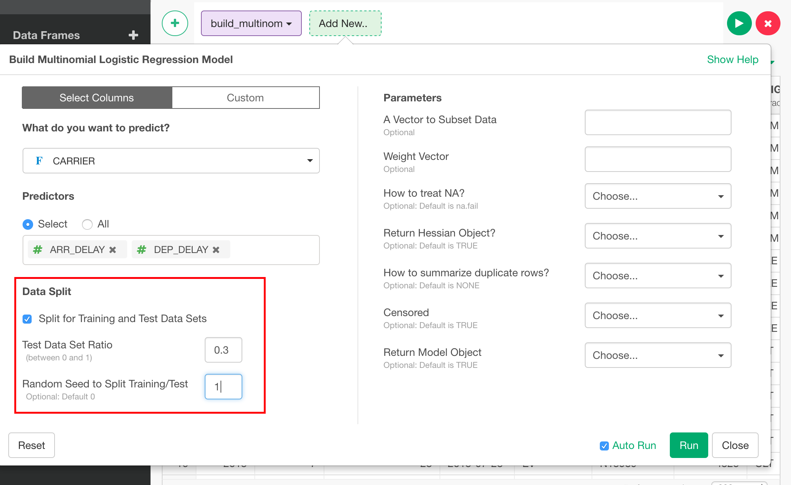
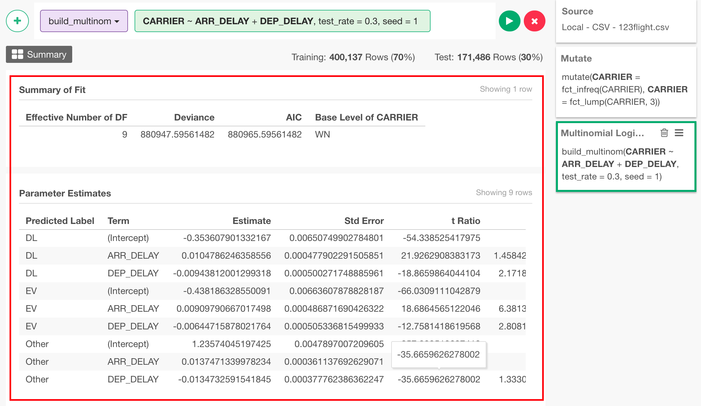

# Multinomial Logistic Regression Model

## Introduction

Multinomial logistic regression model is a statistical model with an assumption that linear relationships are there between explanatory variable and a response variable of multiple labels.

## How to Access?

There are two ways to access. One is to access from 'Add' (Plus) button.

Another way is to access from a column header menu from a numeric column.

## How to Use?

### Column Selection

There are two ways to set what you want to predict by what variables.

If you are on "Select Columns" tab, you can set them by column selector.

If you are on "Custom" tab, you can type a formula directly.

### Train Test Split

You can split the data into training and test to evaluate the performance of the model. You can set

* Test Data Set Ratio - Ratio of test data in the whole data.
* Random Seed to Split Training/Test - You can change random seed to try other training and test data combination.

### Parameters

* A Vector to Subset Data (Optional) - "subset" parameter of lm function.
* Weight Vector (Optional) - "weights" parameter of lm function.
* How to treat NA? (Optional) - "na.action" parameter of lm. function. The default is "na.fail". This changes the behaviour of NA data. Can be one of the following.
  * "na.omit"
  * "na.fail"
  * "na.exclude"
  * "na.pass"
  * NULL
* Return Hessian Object? (Optional) - "Hess" parameter of multinom function. The default is FALSE. Whether the Hessian (the observed/expected information matrix) should be returned.
* How to summarize duplicate rows? (Optional) - "summ" parameter of multinom function. The default is no summarize. If this is indicated, summarize by deleting duplicate rows and adjust weights. Methods 1 and 2 differ in speed (2 uses C); method 3 also combines rows with the same X and different Y, which changes the baseline for the deviance.
* Censored (Optional) - "censored" parameter of multinom function. The default is TRUE. If Y is a matrix with K columns, interpret the entries as one for possible classes, zero for impossible classes, rather than as counts.
* Return Model Object (Optional) - "model" parameter of multinom function. The default is TRUE. If TRUE, the model frame is saved as component model of the returned object.

## How to Read Summary

Once you run it, you will see summary info like this.

### Summary of Fit

* Effective Number of DF - Effective number of degree of freedom.
* Deviance - The residual deviance, compared to the full saturated model (that explains individual observations exactly). Also, minus twice log-likelihood.
* AIC - The AIC for this fit.
* Base Level of ~ - Base line value of factor variables. The values in Parameter Estimates are relative values compared to these base levels

### Parameter Estimates

* Predicted Label - Labels of response variable.
* Term - The term in the model being estimated and tested.
* Estimate - The estimated coefficient.
* Std Error - The standard error from the linear model.
* t Ratio - t-statistic.
* P Value - Two sided p-value.
* Conf Low - Lower bound of 95% confidence interval.
* Conf High - Upper bound of confidence interval.
* Odds Ratio - Exponent of the estimated coefficient.

## Step-by-step

Here's a step-by-step tutorial guide on how you can build, predict and evaluate multinomial logistic regression model.

https://blog.exploratory.io/exploratory-v3-1-released-62e7a2974d4b#487d
