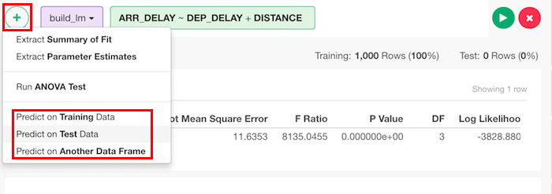
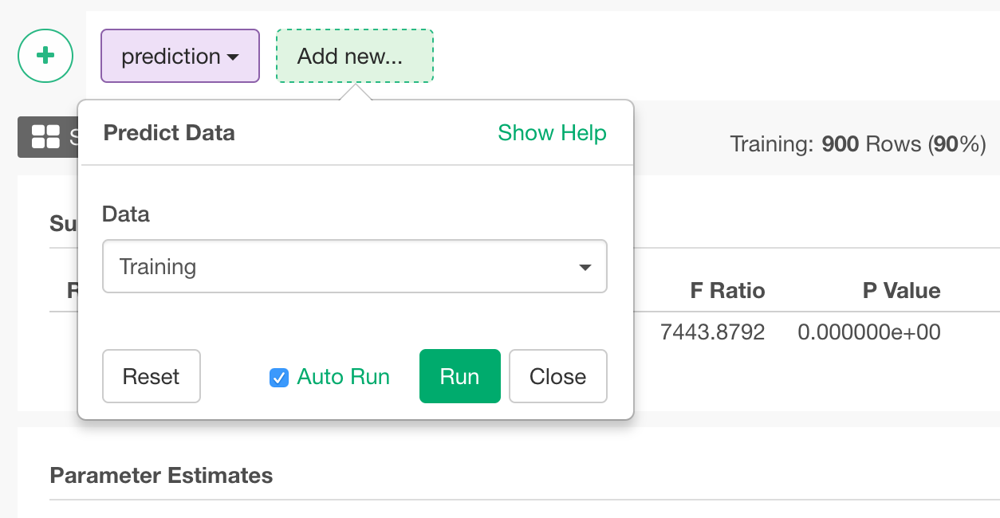

# Predict Data

## How to Access This Feature

### From + (plus) Button
From a step that create a model, you can access it from 'Add' (Plus) button.

## How to Use?

* Data - You can choose
  * Training - Get predicted values by training data.
  * Test - Get predicted values by test data.
  * Data Frame - Get predicted values by other data frame.
