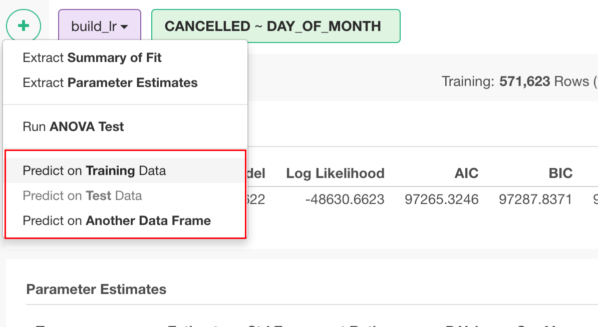
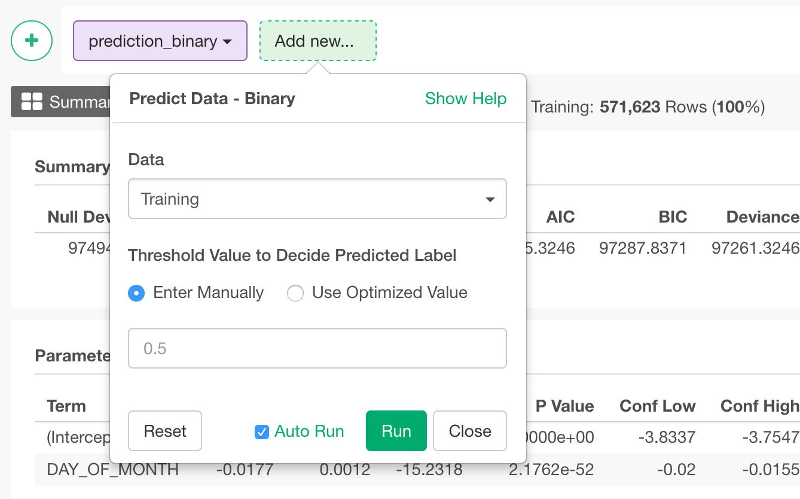

# Predict Data - Binary

## How to Access This Feature

### From + (plus) Button
From a step that create a model, you can access it from 'Add' (Plus) button.

## How to Use?

* Data - You can choose
  * Training - Get predicted values by training data.
  * Test - Get predicted values by test data.
  * Data Frame - Get predicted values by other data frame.

* Threshold Value to Decide Predicted Label - You can choose how to decide threshold for predicted label.
  * Use Optimized Value - This searches threshold to optimize the chosen metric. It can be
   * F Score
   * Accuracy
   * Precision
   * Recall
   * Specificity
 * Enter Manually
   * Set threshold value manually.
