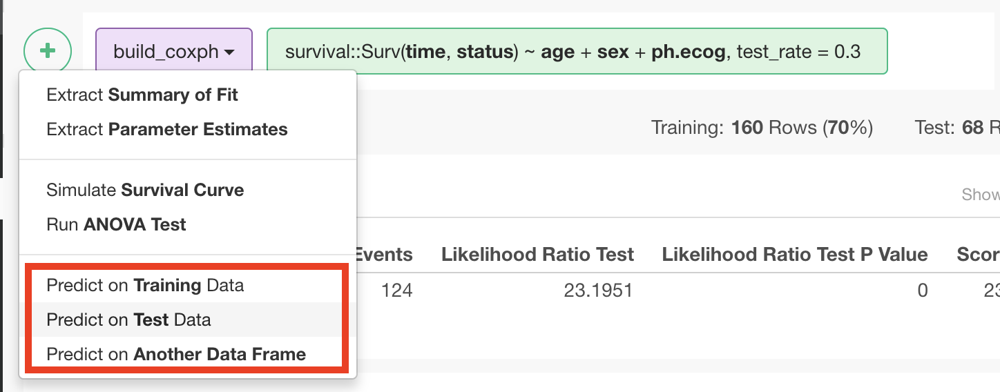
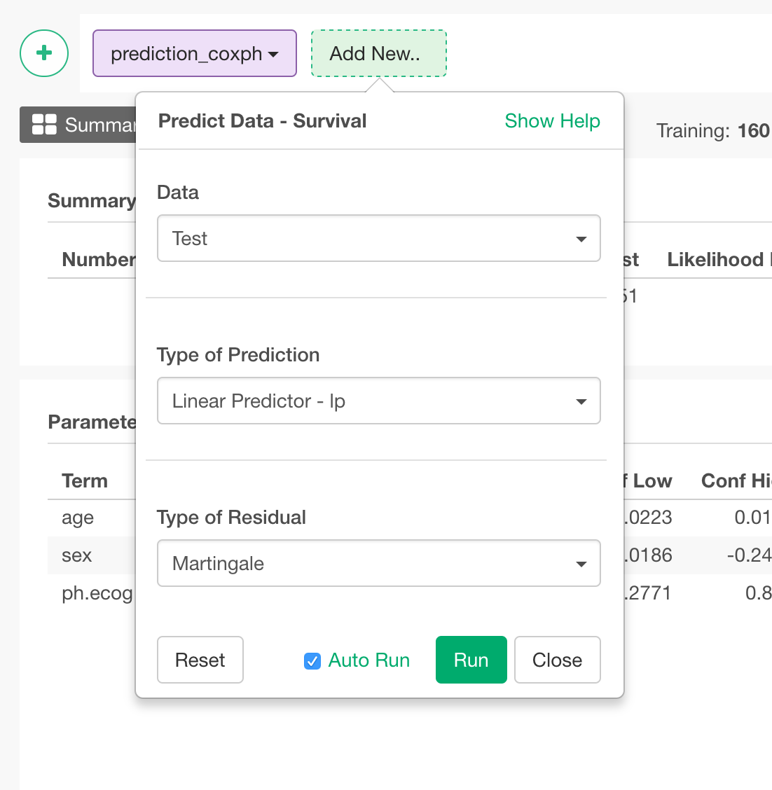

# Predict Data - Survival

Predict with Survival Model.

## How to Access This Feature

### From + (plus) Button
From a step that creates a Survival Model, you can access this feature from 'Add' (Plus) button. Select one of the 3 "Predict" menus.

## How to Use This Feature

1. With "Data" dropdown, select data to predict on from the following options.
  * Training - Get predicted values on training data.
  * Test - Get predicted values on test data.
  * Data Frame - Get predicted values on other data frame.

2. Select "Type of Prediction" from the following options.
  * Linear Predictor - lp - Risk Score on a log scale.
  * Risk Score - exp(lp) - Score for the risk that the event happens within a unit time for the subject.
  * Expected Number of Events - Number of events that would happen on average for a subject that has same condition as the subject during the time the subject has survived.
  * Status at Specified Time - Predicted status of the subject at the specified time.

3. Select "Type of Residual" from the following options.
  * Martingale
  * Deviance
  * Score
  * Schoenfeld
  * Schoenfeld (Scaled)
  * DFBETA
  * DFBETA (Scaled)

4. Click "Run" button to run the prediction.
