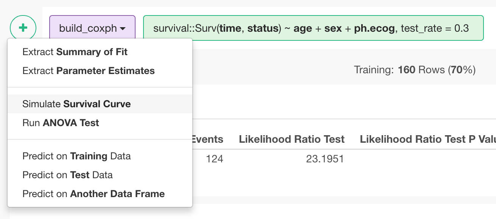
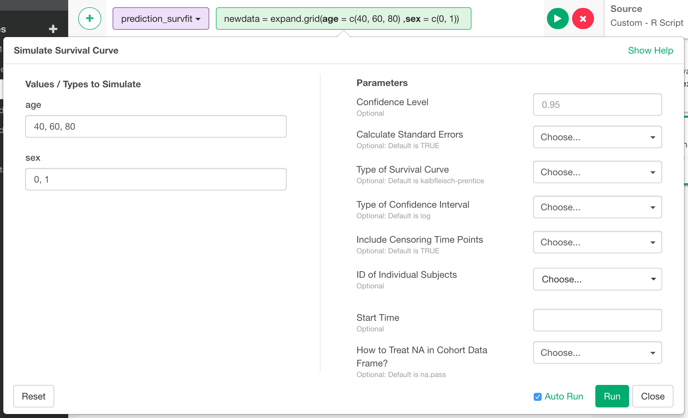
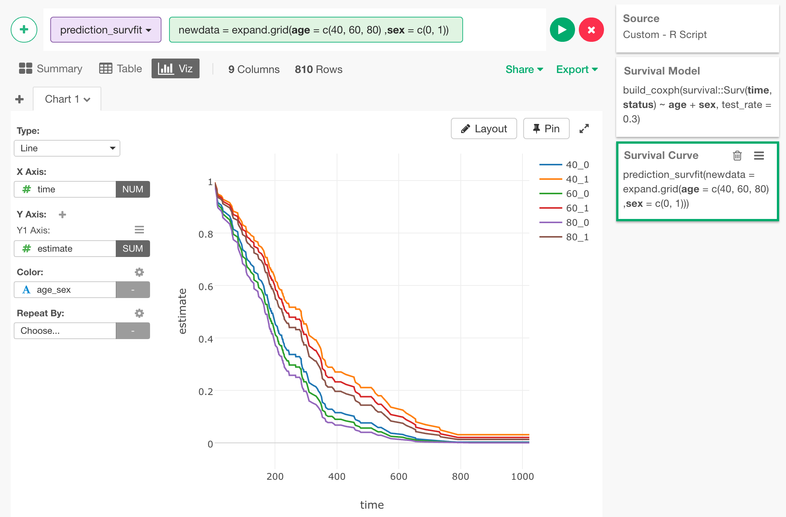

# Simulate Survival Curve

Simulate Survival Curve for a cohort with Survival Model.

## Input Data
Before simulating Survival Curve, you need to create Survival Model (Cox Regression) following [this instruction](./cox-regression.html).

## How to Access This Feature

### From + (plus) Button
From a step that creates a Survival Model, you can access this feature from 'Add' (Plus) button. Select "Simulate Survival Curve" menu.

## How to Use This Feature

1. In "Values / Types to Simulate" section, specify the values for each predictor of the model. Separate multiple values with comma.

2. Specify optional parameters in "Parameters" section.
  * Confidence Level
  * Calculate Standard Errors
  * Type of Survival Curve
  * Type of Confidence Interval
  * Include Censoring Time Points
  * ID of Individual Subjects
  * Start Time
  * How to Treat NA in Cohort Data Frame?

3. Click "Run" button to run the prediction.

## Output Data
The output data is survival curve data. Each row comes with time and estimated survival probability (values between 0.0 to 1.0) up until that time.
Following is the list of output columns.
* Cohort Column - This is the column that indicates which cohort the row belongs to. The column name is concatenation of model predictors. For example, if you are simulating survival curve for different values of "age" predictor and "sex" predictor, the column name becomes "age_sex".
* time - Survival time. This column should be used as X-axis when drawing survival carve in line chart.
* estimate - Estimated survival probability at the time. This column should be used as Y-axis when drawing survival carve in line chart.
* std_error - Standard error of the estimated survival probability value.
* conf_high - Upper bound of the confidence interval for the estimated survival probability value.
* conf_low - Upper bound of the confidence interval for the estimated survival probability value.
* Group Columns - If group_by was applied to the input data, the group columns appears in the output data frame. Survival curve data rows for each group comes with corresponding group column values.
* n_risk - The number of subjects that were surviving at the time.
* n_event - Out of n_risk, to how many of the subjects the event occurred at the time.
* n_censor - Out of n_risk, how many of the subjects we lost track of at the time.

Here is an example of line chart created from the output data. Since we specified 3 different values of "age" (40, 60, 80), and 2 values of "sex", we are seeing 6 (3 times 2) different survival curves that represent each cohort.

