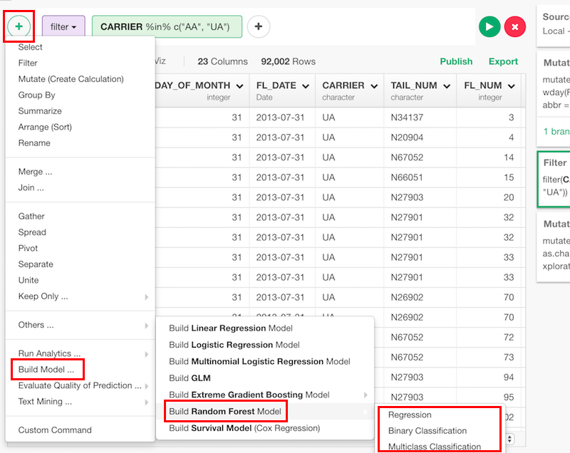
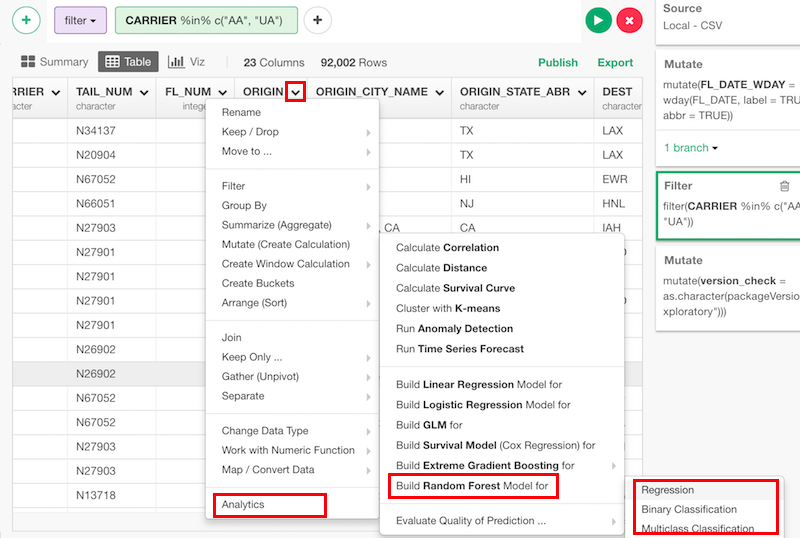
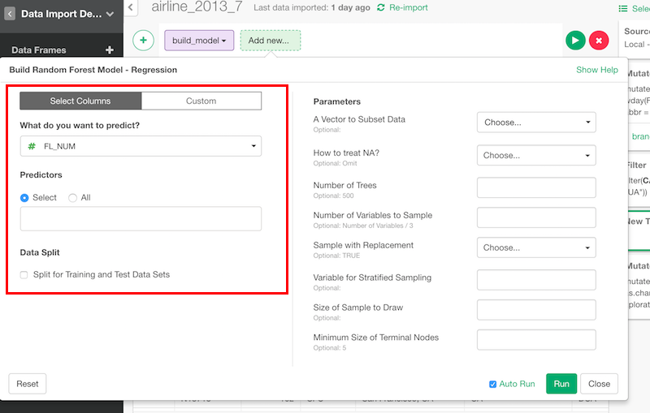
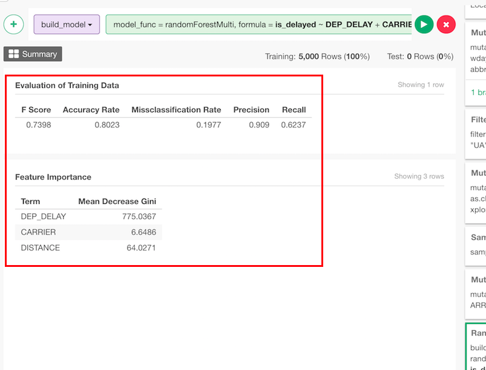
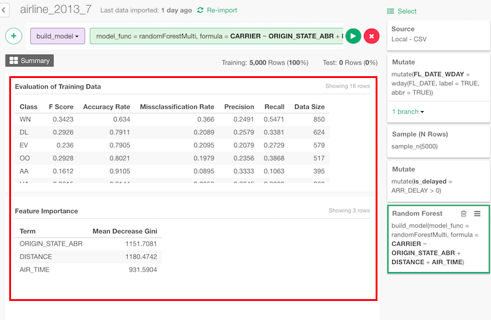

# Random Forest Model

## Introduction

Create random forest model for regression, binary classification and multiclass classification.

## How to Access?

There are two ways to access. One is to access from 'Add' (Plus) button.

Another way is to access from a column header menu.

## How to Use?

### Column Selection

There are two ways to set what you want to predict by what variables.

If you are on "Select Columns" tab, you can set them by column selector.

If you are on "Custom" tab, you can type a formula directly.

### Train Test Split

You can split the data into training and test to evaluate the performance of the model. You can set

* Test Data Set Ratio - Ratio of test data in the whole data.
* Random Seed to Split Training/Test - You can change random seed to try other training and test data combination.

### Regression

#### Parameters

* A Vector to Subset Data	(Optional) - Logical column to subset data.
* How to treat NA? (Optional) - The default is "Omit". This changes the behaviour of NA data. Can be one of the following.
  * Omit
  * Fail
  * Exclude
  * Pass
  * Null
* Number of Trees	(Optional) - The default is 500. Number of trees to grow.
* Number of Variables to Sample (Optional) - The default is 1/3 of number of variables. Number of variables randomly sampled as candidates at each split.
* Sample with Replacement (Optional) - The default is TRUE. Whether sampling is done with replacement.
* Variable for Stratified Sampling (Optional) - A (factor) variable that is used for stratified sampling.
* Size of Sample to Draw (Optional) - Size of sample to draw.
* Minimum Size of Terminal Nodes (Optional) - The default is 5. Minimum size of terminal nodes.
* Assess Importance (Optional) - The default is FALSE. Whether importance of predictors is assessed.
* Compute Casewise Importance (Optional) - The default is FALSE. Whether casewise importance measure is computed.
* Measure Proximity (Optional) - The default is FALSE. Whether proximity measure among the rows is calculated.
* Proximity on Out-of-Bag Data (Optional) - The default is same as "Measure Proximity". Whether proximity is calculated only on "out-of-bag" data.
* Keep Forest (Optional) - The default is TRUE. Whether the forest is retained in the output object.
* Perform Bias Correction (Optional) - The default is FALSE. If bias correction for regression is performed.
* Keep In-Bag (Optional) - The default is FALSE. Whether an n by ntree matrix be returned that keeps track of which samples are “in-bag” in which trees.

#### How to Read Summary

* Mean of Mean Square Error - Mean of mean square errors vector.
* Mean of R Square - Mean of pseudo R-squared.

### Binary Classification

#### Parameters

* A Vector to Subset Data	(Optional) - Logical column to subset data.
* How to treat NA? (Optional) - The default is "Omit". This changes the behaviour of NA data. Can be one of the following.
  * Omit
  * Fail
  * Exclude
  * Pass
  * Null
* Number of Trees	(Optional) - The default is 500. Number of trees to grow.
* Number of Variables to Sample (Optional) - The default is square root of number of variables. Number of variables randomly sampled as candidates at each split.
* Sample with Replacement (Optional) - The default is TRUE. Whether sampling is done with replacement.
* Priors of Classes (Optional) - Priors of the classes.
* A Vector for Cutoff (Optional) - A vector of length equal to number of classes. The ‘winning’ class for an observation is the one with the maximum ratio of proportion of votes to cutoff. Default is 1/k where k is the number of classes.
* Variable for Stratified Sampling (Optional) - A (factor) variable that is used for stratified sampling.
* Size of Sample to Draw (Optional) - Size of sample to draw.
* Minimum Size of Terminal Nodes (Optional) - The default is 1. Minimum size of terminal nodes.
* Assess Importance (Optional) - The default is FALSE. Whether importance of predictors is assessed.
* Compute Casewise Importance (Optional) - The default is FALSE. Whether casewise importance measure is computed.
* Number of Permutation (Optional) - The default is FALSE. Number of times the OOB data are permuted per tree for assessing variable importance.
* Measure Proximity (Optional) - The default is FALSE. Whether proximity measure among the rows is calculated.
* Proximity on Out-of-Bag Data (Optional) - The default is same as proximity. Whether proximity is calculated only on "out-of-bag" data.
* Normalize Votes (Optional) - The default is TRUE. Whether the final result of votes are expressed as fractions. If FALSE, raw vote counts are returned (useful for combining results from different runs).
* Keep Forest (Optional) - The default is TRUE. Whether the forest is retained in the output object.
* Perform Bias Correction (Optional) - The default is FALSE. If bias correction for regression is performed.
* Keep In-Bag (Optional) - The default is FALSE. Whether an n by ntree matrix be returned that keeps track of which samples are “in-bag” in which trees.

#### How to Read Summary

##### Evaluation of Training Data

* F Score - Harmonic mean of Precision and Recall. 2 * Precision * Recall / (Precision + Recall)
* Accuracy Rate - Ratio of correct classification in training data.
* Missclassification Rate - Ratio of incorrect classification in training data.
* Precision - How many relevant items are selected.
* Recall - How many selected items are relevant.

##### Feature Importance

* Term - The term in the linear model being estimated and tested.
* Mean Decrease Gini - Mean of Gini index decrease by the term.

### Multiclass Classification

#### Parameters

* A Vector to Subset Data	(Optional) - Logical column to subset data.
* How to treat NA? (Optional) - The default is "Omit". This changes the behaviour of NA data. Can be one of the following.
  * Omit
  * Fail
  * Exclude
  * Pass
  * Null
* Number of Trees	(Optional) - The default is 500. Number of trees to grow.
* Number of Variables to Sample (Optional) - The default is square root of number of variables. Number of variables randomly sampled as candidates at each split.
* Sample with Replacement (Optional) - The default is TRUE. Whether sampling is done with replacement.
* Priors of Classes (Optional) - Priors of the classes.
* A Vector for Cutoff (Optional) - A vector of length equal to number of classes. The ‘winning’ class for an observation is the one with the maximum ratio of proportion of votes to cutoff. Default is 1/k where k is the number of classes.
* Variable for Stratified Sampling (Optional) - A (factor) variable that is used for stratified sampling.
* Size of Sample to Draw (Optional) - Size of sample to draw.
* Minimum Size of Terminal Nodes (Optional) - The default is 1. Minimum size of terminal nodes.
* Assess Importance (Optional) - The default is FALSE. Whether importance of predictors is assessed.
* Compute Casewise Importance (Optional) - The default is FALSE. Whether casewise importance measure is computed.
* Number of Permutation (Optional) - The default is FALSE. Number of times the OOB data are permuted per tree for assessing variable importance.
* Measure Proximity (Optional) - The default is FALSE. Whether proximity measure among the rows is calculated.
* Proximity on Out-of-Bag Data (Optional) - The default is same as proximity. Whether proximity is calculated only on "out-of-bag" data.
* Normalize Votes (Optional) - The default is TRUE. Whether the final result of votes are expressed as fractions. If FALSE, raw vote counts are returned (useful for combining results from different runs).
* Keep Forest (Optional) - The default is TRUE. Whether the forest is retained in the output object.
* Perform Bias Correction (Optional) - The default is FALSE. If bias correction for regression is performed.
* Keep In-Bag (Optional) - The default is FALSE. Whether an n by ntree matrix be returned that keeps track of which samples are “in-bag” in which trees.

Take a look at the [reference document](http://ugrad.stat.ubc.ca/R/library/randomForest/html/randomForest.html) for the 'randomForest' function from randomForest package for more details on the parameters.

#### How to Read Summary

##### Evaluation of Training Data

* Class - Label of the class.
* F Score - Harmonic mean of Precision and Recall. 2 * Precision * Recall / (Precision + Recall)
* Accuracy Rate - Ratio of correct classification in training data.
* Missclassification Rate - Ratio of incorrect classification in training data.
* Precision - How many relevant items are selected.
* Recall - How many selected items are relevant.
* Data Size - Number of Data

##### Feature Importance

* Term - The term in the linear model being estimated and tested.
* Mean Decrease Gini - Mean of Gini index decrease by the term.
