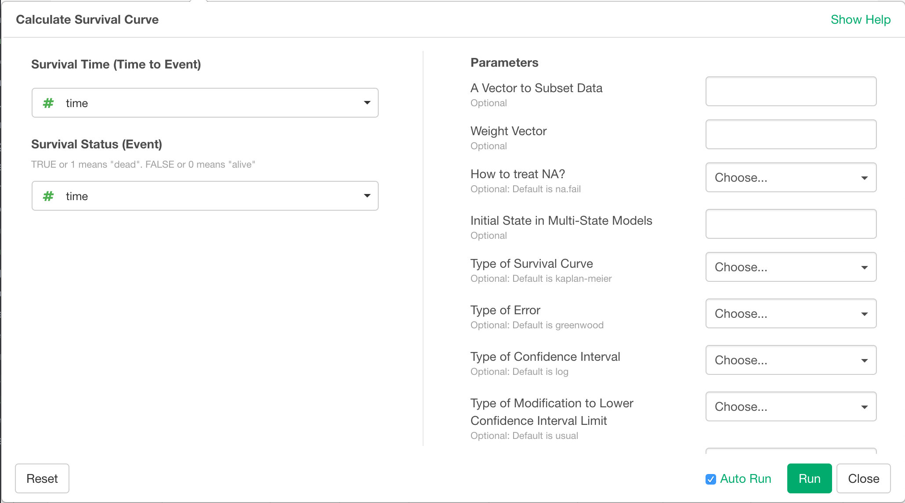
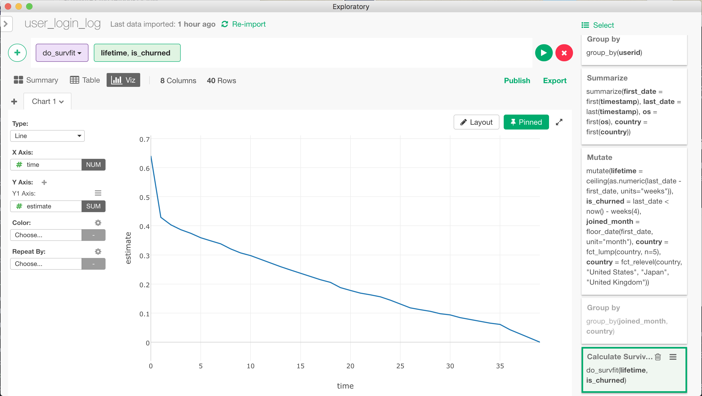
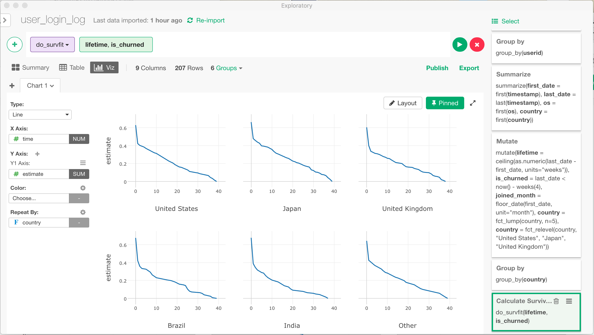

# Calculate Survival Curve
Calculates Survival Curve from survival time and survival status.

## Input Data
Input data should be a survival data. Each row should represent one observation (e.g. one user of a subscription service). It should have following columns.
  * Survival Time - A numeric column with survival time. Also called "time to event".
  * Survival Status - A boolean or binary numeric value (can take value of 1 or 0) column with survival status. When this column is true or 1, it means the event of interest happened to the subject at the end of survival time. If it is false or 0, it means we know that the event had not happened to the subject at least until the end of the survival time, but we don't know what happened to the subject after that point.

## How to Access This Feature
* Click "+" button and mouse over "Run Analytics ...", and select "Calculate Survival Curve" submenu to open "Calculate Survival Curve" dialog.
* You can also select "Run Analytics ..." from column menu of the survival time column, and then select "Calculate Survival Curve" submenu to open "Calculate Survival Curve" dialog.

## Calculate Survival Curve
After "Calculate Survival Curve" dialog is opened, follow the steps below to calculate survival curve.

1. Select survival time column with "Survival Time (Time to Event)" dropdown.
2. Select survival status column with "Survival Status (Event)" dropdown.
3. (Optional) Specify additional parameters in "Parameters" section.
  * A Vector to Subset Data
  * Weight Vector
  * How to treat NA?
  * Initial State in Multi-State Models
  * Type of Survival Curve
  * Type of Error
  * Type of Confidence Interval
  * Type of Modification to Lower Confidence Interval Limit
  * Confidence Level
  * Return Standard Errors
  4. Click "Run" button.

# Output Data
The output data is survival curve data. Each row comes with time and estimated survival probability (values between 0.0 to 1.0) up until that time.
Following is the list of output columns.
* time - Survival time. This column should be used as X-axis when drawing survival carve in line chart.
* estimate - Estimated survival probability at the time. This column should be used as Y-axis when drawing survival carve in line chart.
* std_error - Standard error of the estimated survival probability value.
* conf_high - Upper bound of the confidence interval for the estimated survival probability value.
* conf_low - Upper bound of the confidence interval for the estimated survival probability value.
* Group Columns - If group_by was applied to the input data, the group columns appears in the output data frame. Survival curve data rows for each group comes with corresponding group column values.
* n_risk - The number of subjects that were surviving at the time.
* n_event - Out of n_risk, to how many of the subjects the event occurred at the time.
* n_censor - Out of n_risk, how many of the subjects we lost track of at the time.

Here is an example of line chart created from the output data. As time goes by, the probability of survival goes down getting closer to 0.

Here is another example with group_by applied to the input data. By applying group_by on "country" column, survival curve for each country is drawn here.

## Reference
[Introduction to Survival Analysis Part 1— Survival Curve](https://blog.exploratory.io/introduction-to-survival-analysis-part-1-survival-curve-9364ea642114)
