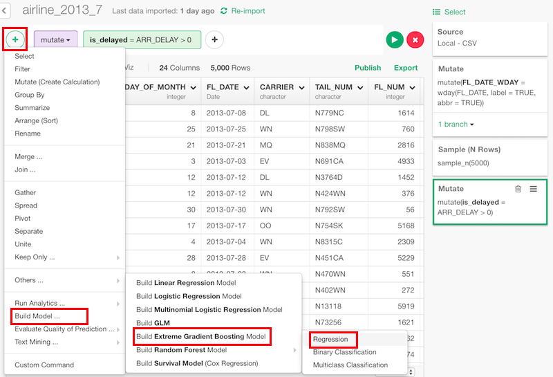
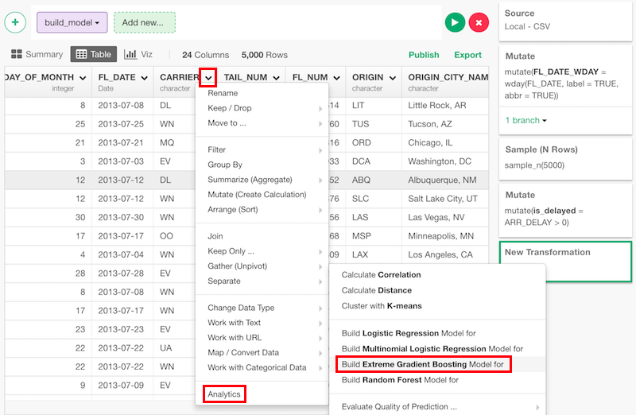
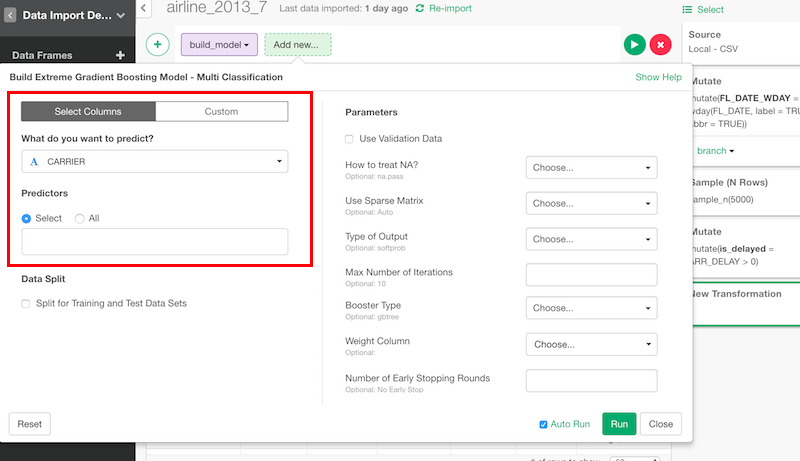
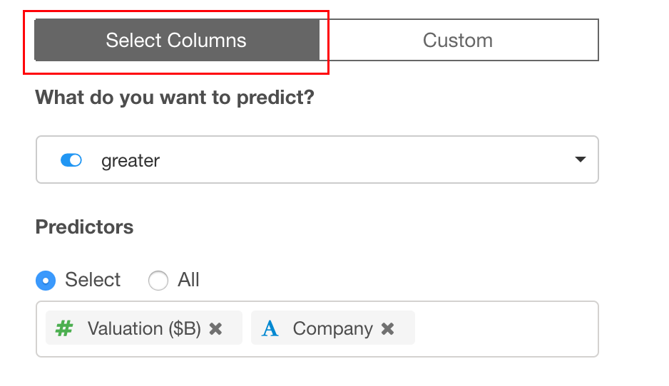
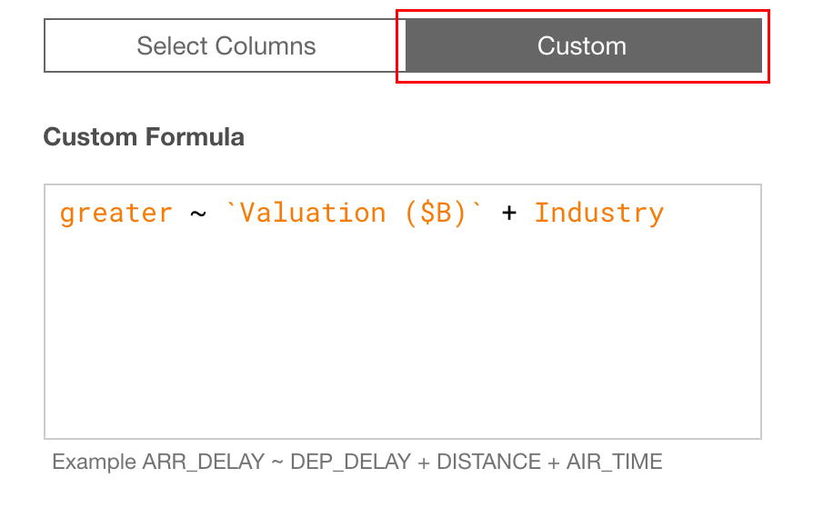
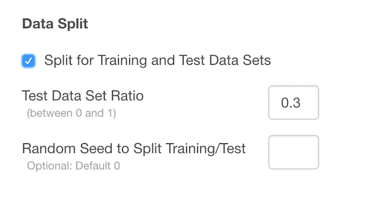

# XGBoost - Extreme Gradient Boosting

## Introduction

Create extreme gradient boosting model regression, binary classification and multiclass classification.

## How to Access?

There are two ways to access. One is to access from 'Add' (Plus) button.

Another way is to access from a column header menu.

## How to Use?

### Column Selection

There are two ways to set what you want to predict by what variables.

If you are on "Select Columns" tab, you can set them by column selector.

If you are on "Custom" tab, you can type a formula directly.

### Train Test Split

You can split the data into training and test to evaluate the performance of the model. You can set

* Test Data Set Ratio - Ratio of test data in the whole data.
* Random Seed to Split Training/Test - You can change random seed to try other training and test data combination.

### Regression

#### Parameters

* Use Validation Data	(Optional) - You can set data randomly selected to use as validation data set to watch the performance of the model against data that is not used for learning process. It prevents overfitting.
* output_type (Optional) - The default is "linear". What distribution the target variable follows. This can be
  * "linear"
  * "logistic"
  * "gamma"
  * "tweedie"
* nrounds (Optional) - The default is 10. Max number of iterations for training.
* booster (Optional) - The default is "gbtree". Distribution that the target variable follows. This can be
  * "gbtree"
  * "gblinear"
  * "dart"
* eval_metric (Optional) - The default is "rmse" for linear and logistic, "gamma-nloglik" for gamma and "tweedie-nloglik" for tweedie output type. Evaluation metrics to optimize by training.
  * "rmse" - Root mean square error
  * "mae" - Mean absolute error
  * "gamma-nloglik" - Negative log likelihood for gamma distribution
  * "gamma-deviance" - Residual deviance for gamma distribution
* weight (Optional) - The default is NULL. A column with weight for each data.
* early_stopping_rounds (Optional) - The default is NULL. The number of iterations to stop after the performance doesn't improve.
* How to treat NA? (Optional) - The default is "Omit". This changes the behaviour of NA data. Can be one of the following.
  * Omit
  * Fail
  * Exclude
  * Pass
  * Null
* Number of Trees	(Optional) - The default is 500. Number of trees to grow.
* Number of Variables to Sample (Optional) - The default is 1/3 of number of variables. Number of variables randomly sampled as candidates at each split.
* Sample with Replacement (Optional) - The default is TRUE. Whether sampling is done with replacement.
* Variable for Stratified Sampling (Optional) - A (factor) variable that is used for stratified sampling.
* Size of Sample to Draw (Optional) - Size of sample to draw.
* Minimum Size of Terminal Nodes (Optional) - The default is 5. Minimum size of terminal nodes.
* Assess Importance (Optional) - The default is FALSE. Whether importance of predictors is assessed.
* Compute Casewise Importance (Optional) - The default is FALSE. Whether casewise importance measure is computed.
* Measure Proximity (Optional) - The default is FALSE. Whether proximity measure among the rows is calculated.
* Proximity on Out-of-Bag Data (Optional) - The default is same as "Measure Proximity". Whether proximity is calculated only on "out-of-bag" data.
* Keep Forest (Optional) - The default is TRUE. Whether the forest is retained in the output object.
* Perform Bias Correction (Optional) - The default is FALSE. If bias correction for regression is performed.
* Keep In-Bag (Optional) - The default is FALSE. Whether an n by ntree matrix be returned that keeps track of which samples are “in-bag” in which trees.

### How to Read Summary

* Mean of Mean Square Error - Mean of mean square errors vector.
* Mean of R Square - Mean of pseudo R-squared.

## Step-by-step

Here's a step-by-step tutorial guide on how you can build, predict and evaluate logistic regression model.

* [Introduction to Extreme Gradient Boosting in Exploratory](https://blog.exploratory.io/introduction-to-extreme-gradient-boosting-in-exploratory-7bbec554ac7)
