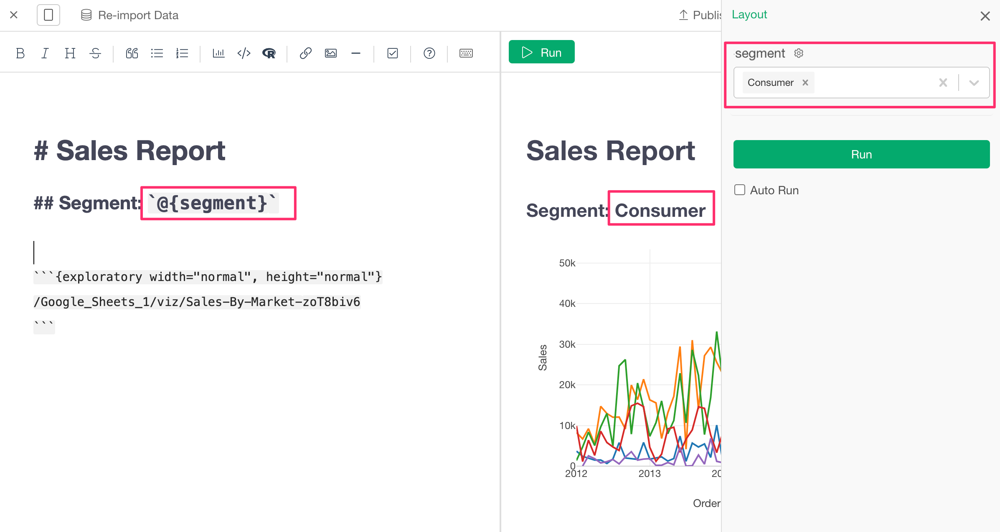
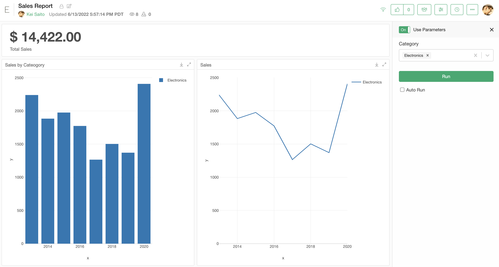
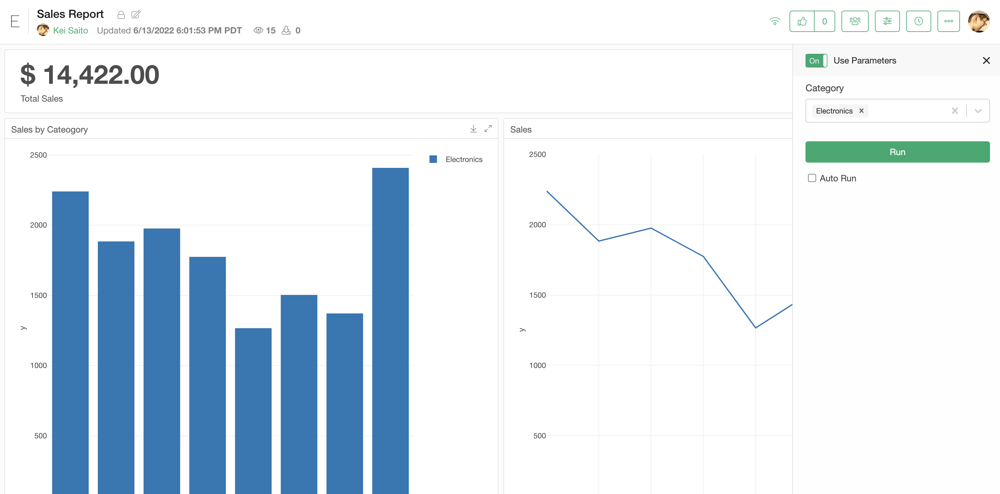
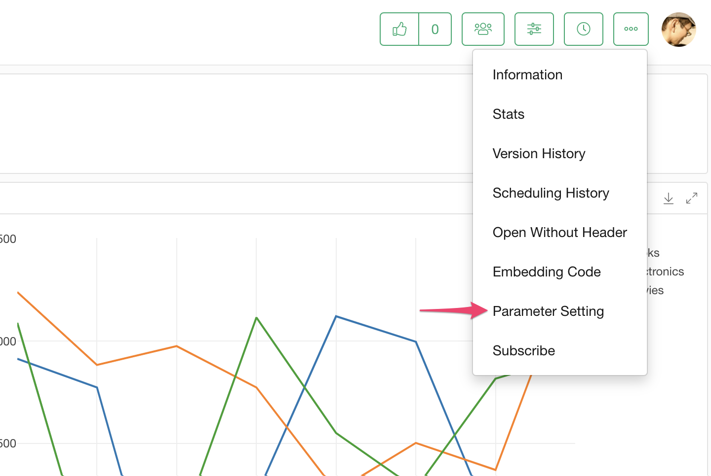
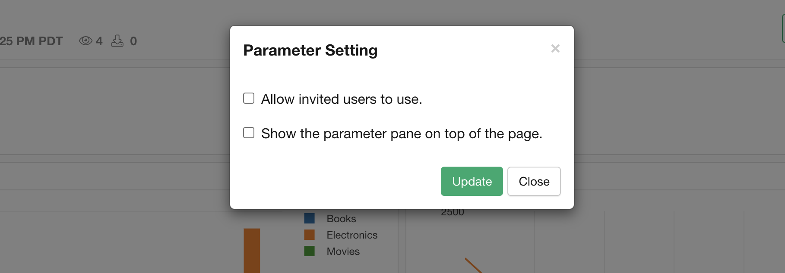

# Parameter

With Parameter, you can make your data wrangling pipeline, Chart, Analytics, Note, Dashboard, etc. more dynamic or more interactive.

For example, you might want to make your SQL queries dynamic (Parameterized Queries), your filter step dynamic, and Dashboard to be more interactive so that the users of the Dashboard can change the data based on their interests.

## Type of Parameters

You can define following types of Parameters.

- Character
  - Text Field Input
  - Single Value Selector Input
  - Multiple Value Selector Input
- Number
  - Text Field Input
  - Slider Input
  - Single Value Selector Input
  - Multiple Value Selector Input
- Date
- DateTime (POSIXct)
- Logical (TRUE/FALSE)


## Where to Use Parameters

You can use the defined parameters from following places in your data processing, analysis, and/or visualization.

- Data Sources
  - Database Query
    - SQL Databases
    - MongoDB
  - Custom R Data Source
- Filter Step
- Mutate Step
- Summarize Step
- Chart Filter
- Analytics Filter


## What Can Be Parametrized by Parameters

By using Parameters, following Views on Exploratory Desktop or Dashboards/Documents published at exploratory.io or Collaboration Server can be parametrized.

### On Exploratory Desktop

- Summary View
- Table View
- Chart
- Analytics
- Dashboard
- Note

### Dashboards/Documents Published at exploratory.io or Collaboration Server

- Data 
- Chart
- Analytics
- Dashboard
- Note

## Properties of a Parameter

You can specify the following properties for a parameter when the parameter is embedded in an SQL or MongoDB query.

- quote - Controls whether to quote the value of the parameter in the SQL or MongoDB query, and with what kind of quotation. The defaylt is double quotation.
  - `'"'` - Double quote the parameter value.
  - `"'"` - Single quote the parameter value.
  - FALSE - Do not quote the parameter value.
- escape - Controls whether to escape the value of the parameter in the SQL or MongoDB query, and for what kind of quotation. The default is escaping for double quotation.
  - `'"'` - Escape the parameter value so that it can be used with double quotation.
  - `"'"` - Escape the parameter value so that it can be used with single quotation.
  - FALSE - Do not escape the parameter value.

### Examples:

- Do not quote "search_string" parameter value, but escape it so that it can be used within single-quotation.

```
SELECT * FROM Customers WHERE CustomerName LIKE '%@{search_string, quote=FALSE, escape="'"}%';
```

- Do not either quote or escape "email_domain_regex" parameter value in the MongoDB query.

```
{email: /@{email_domain_regex, quote=FALSE, escape=FALSE}$/}
```


## Showing the Parameter Value on Note / Dashboard

You can show the current parameter value on the Note / Dashboard using the `` `@{parameter_name}` `` notation like the following.




## Parameter Pane Style on the Server View. 

There are 2 types of parameter pane styles on the server view. 


### Fit the parameter pane

The parameter pane fits in the same view as the insight pane. 




### Show the parameter pane on top of the pane

The parameter pane shows up on the top of the insight pane. 





You can change the style from the Parameter Setting dialog on the server view. You can select the "Parameter Setting" from the menu to open the dialog.



You can change the "Show the parameter pane on top of the pane" checkbox and click the "Update" button to change the style.





## Learn More

This [note](https://exploratory.io/note/kanaugust/An-Introduction-to-Parameter-in-Exploratory-WCO4Vgn7HJ) explains how to use Parameters in Exploratory in detail.
