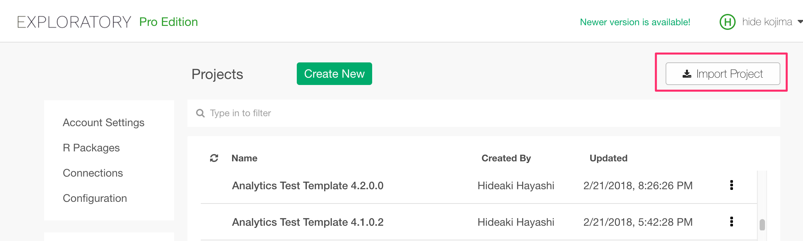
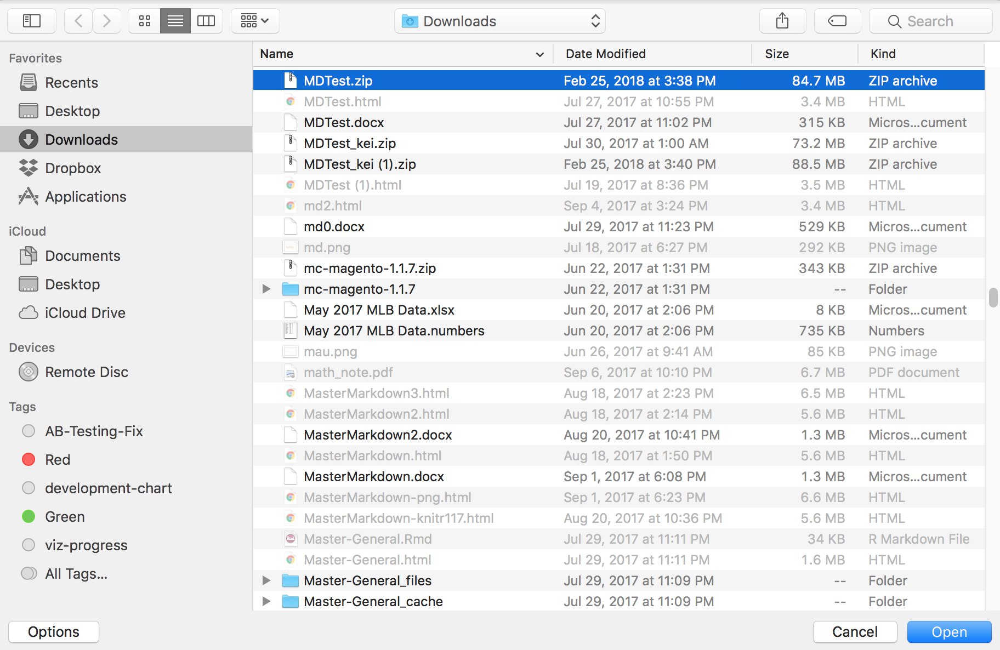

# How to import Project

You can import a project that is exported as a zip file.
Click import button on right hand side top of the Project List page.

And select the project zip file that you want to import.

