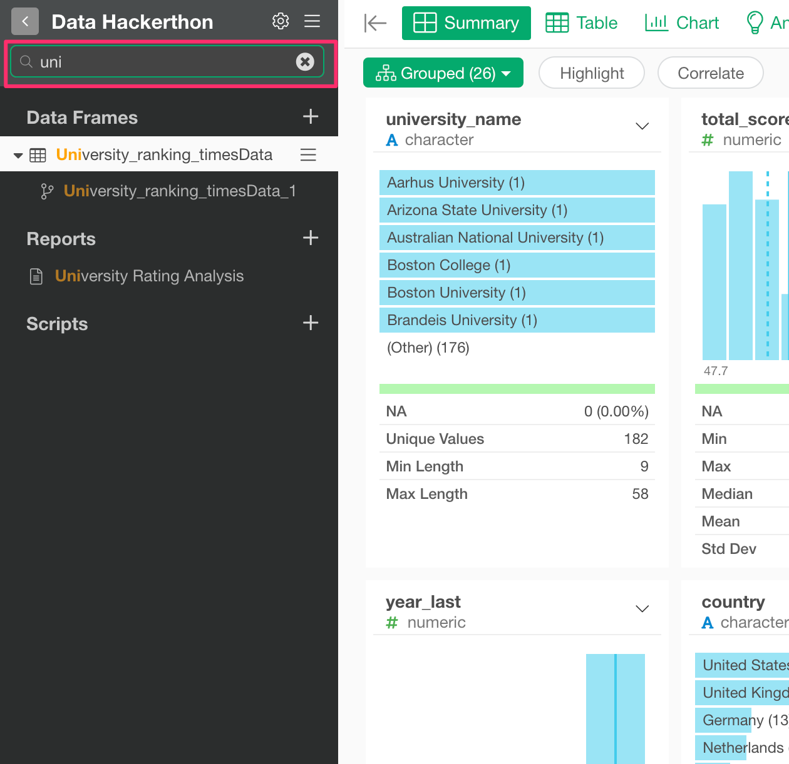

# How to search the Project

You can search the project by typing in a keyword at the seach text input.

If you type in a keyword, only the objects that match the keyword show up in the tree on the left-hand side. The matched keyword will be highlighted. The search is case-insensitive.

The search targets are the following.

* Data Frame name
* Chart name
* Chart comment
* Analytics name
* Analytics comment
* Report (Note, Slide Dashboard) name
* Report (Note, Slide Dashboard) description
* Script name 

 

## How to exit the search

You can click 'x' icon to quit the search.

