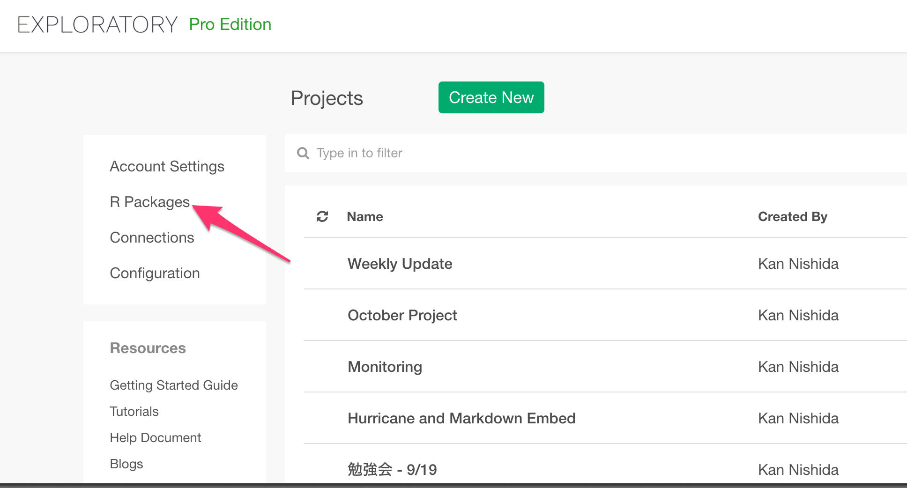
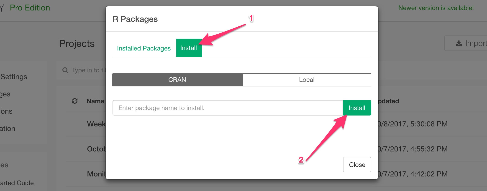

# Install R Package

## Install from CRAN

You can install your preferred R packages from [CRAN](https://cran.r-project.org) where you can find over 9,000 (as of 2016/8/20) packages.

#### 1. Click on 'R Packages' on the project list page.



#### 2. Click 'Install' tab.



#### 3. Type the package name and click on Install button.


## Install R Packages that are not on CRAN

If you want to install R packages that are not on CRAN, then you can install them in the standard R console by setting ‘libPath’ so that the packages will be installed into the location Exploratory is referencing to, which is under <your home directory>/.exploratory/R .

Example:
```
.libPaths("~/.exploratory/R/3.3")
install.packages("../exploratory_0.3.6.8.tgz", repos = NULL, type="source”)
```

If you want to use the functions from this custom R package as part of the command line then you want to add a custom R Script file that contains ‘library’ call so that your custom R package will be loaded. Please refer to [this blog post](https://blog.exploratory.io/adding-custom-r-scripts-to-extend-exploratory-desktop-a054832b9562#.68ny44np1) for how to add R Script to the projects.


## How to use installed R packages? 

Here is a blog post that walk you through how to install and use your preferred R packages in Exploratory Desktop.

* [Installing R Packages from CRAN in Exploratory Desktop](https://blog.exploratory.io/installing-r-packages-from-cran-in-exploratory-desktop-36eae50cffb0#.8oqk14mrj)
