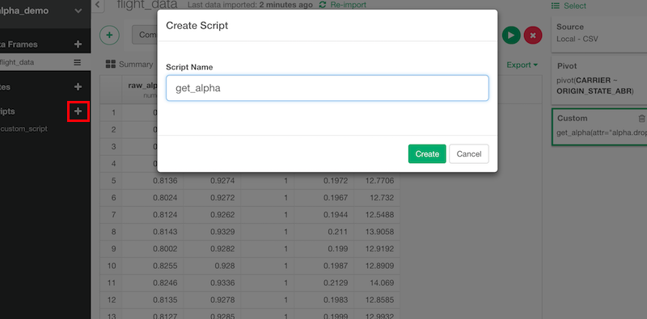
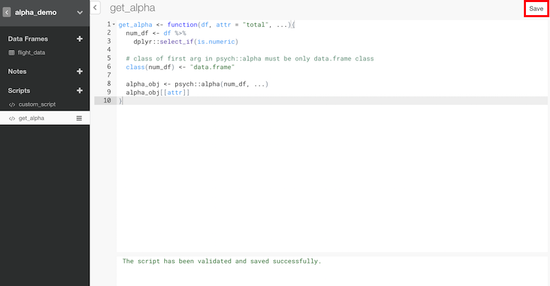
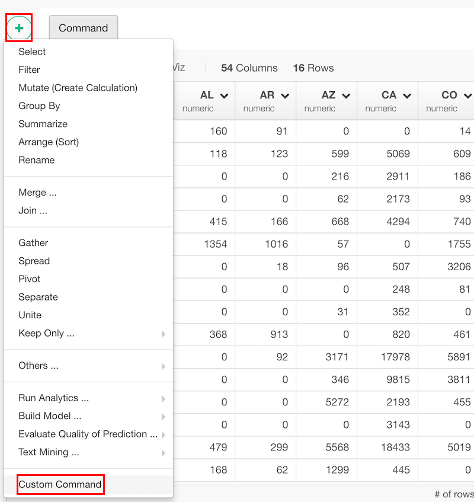
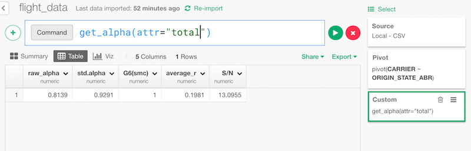

## Add your own custom R functions or variables with R Script

You might want to use your own R functions as part of your data wrangling steps. This is an introduction for such case. If you want to write your own R functions to extract data, please refer to [Write R Script for Data](import/r-script-data.md).

You can write your functions in an R script and register it to your project, then you can start calling the functions just like any other functions.

## Example - **alpha** function from **psych** package

This is an example to use alpha function from [psych](https://cran.r-project.org/web/packages/psych/) R package from Exploratory Desktop.

### Install Required Package

In this example, psych is already installed as a default dependency package but the function you want to use might be from a package that we don't install as default. In that case, please install the package following this instruction.

[Install R Package](../r_package.md)

### Add R Script

Create a new R script from the left tree.



### Define the Function

Define a function. Please note that the first argument is data frame and the output is also data frame, so that it can be used from command line.

```r
get_alpha <- function(df, attr = "total", ...){
  num_df <- df %>%
    dplyr::select_if(is.numeric)

  # class of first arg in psych::alpha must be only data.frame class
  class(num_df) <- "data.frame"

  alpha_obj <- psych::alpha(num_df, ...)
  alpha_obj[[attr]]
}
```

Then, click "Save" button.



### Use It as a Command

You can use the function from a data frame you want to apply. Click 'Add' (Plus) button and click "Custom Command".



Then you can enter the function in the command line.




### Step-by-step

Here is a blog post that walk you through how to register the R script and use the functions.

* [Adding Custom R Scripts to Extend Exploratory Desktop](https://blog.exploratory.io/adding-custom-r-scripts-to-extend-exploratory-desktop-a054832b9562#.68ny44np1)

* [Calculating distances between two locations with geosphere package](https://blog.exploratory.io/calculating-distances-between-two-geo-coded-locations-358e65fcafae)
