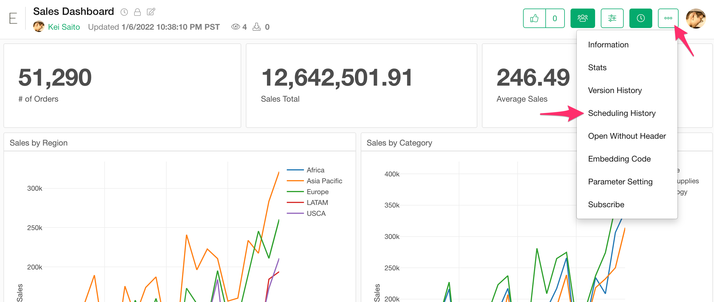
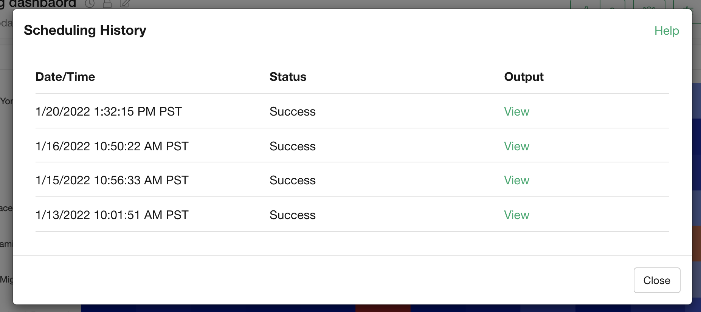

# Scheduling History

You can check the scheduling history from the "Scheduling History" menu.

In the "Scheduling History" dialog, you can check the date/time, status, and output (screenshot images) of each schedule run.

Output is available for weekly or daily schedules for Charts, Analytics, and Dashboards.

