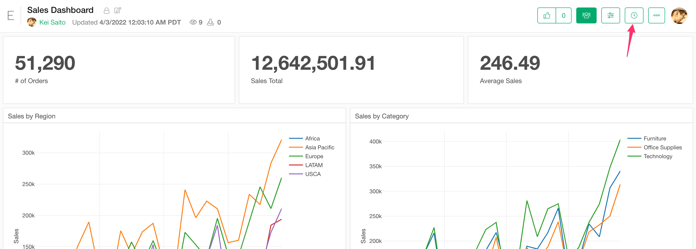
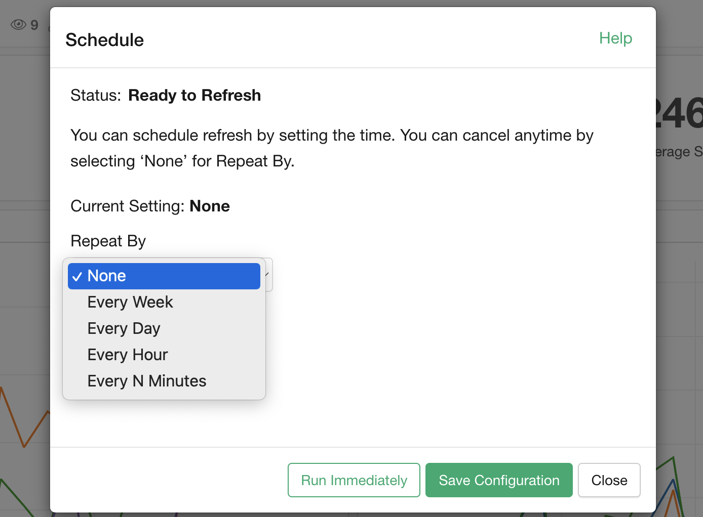
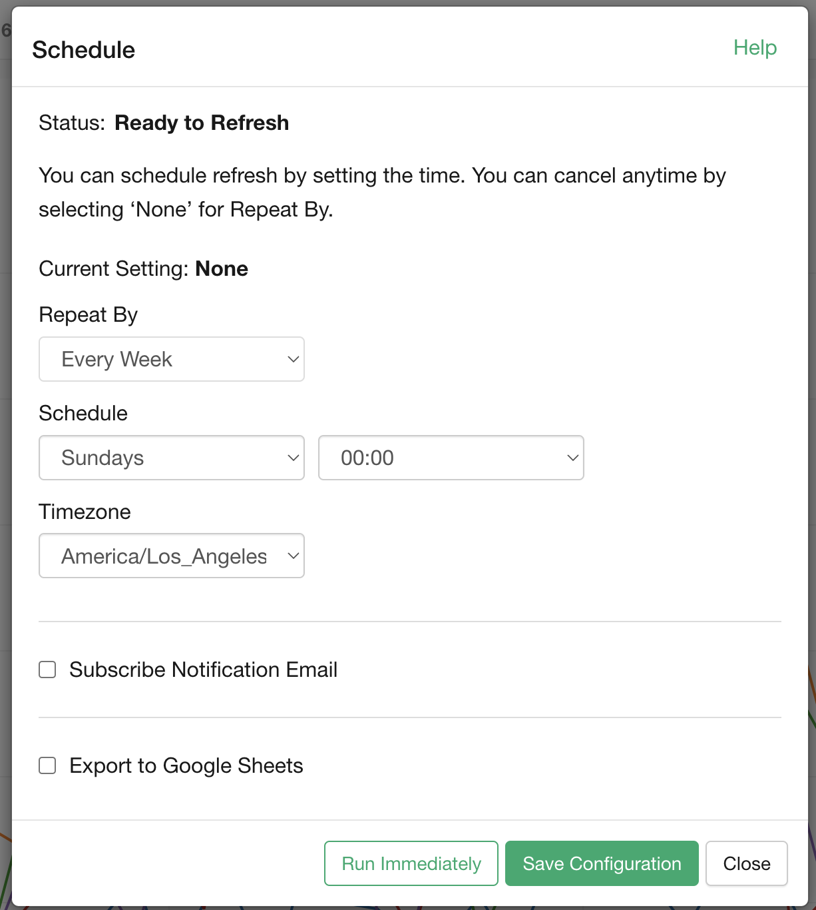
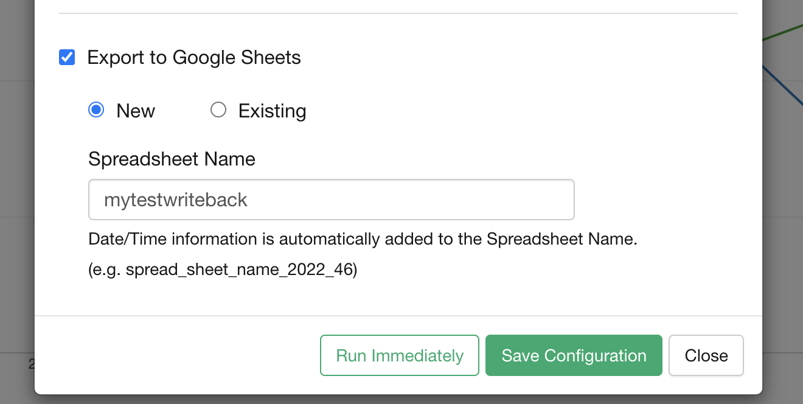
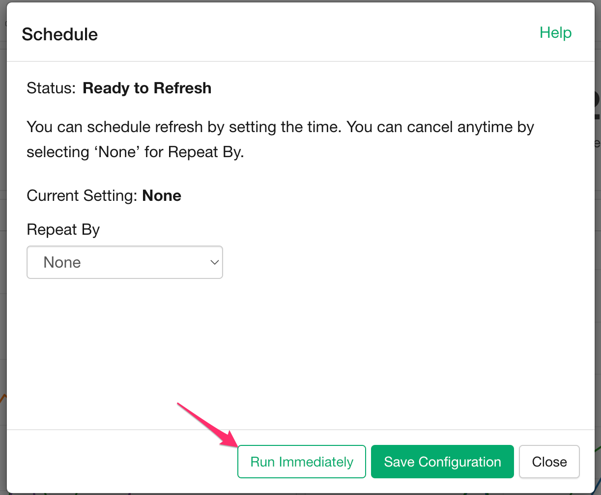

# Publish Insights

In order to schedule your insight, you need to publish your insight to the server first. See the [document](/product-features/share) for mote details.

# Manage Schedules

You can click the clock icon to open the scheduling dialog for managing schedules. 

If the insight is not capable for scheduling, the clock icon doesn't show up. The popular reasons are the following.

* Data is coming from your local file. The data should be accessible from the network for scheduling.  
* Data source type doesn't support scheduling such as "R Script" data source. 

You can change the scheduling frequency from the "Repeat By" dropdown. The following options are available.

* Every Week
* Every Day
* Every Hour
* Every N Minutes (Available only for Business plan users)

Once you choose the Repeat By option, you see the scheduling details. Change the setting to your needs. 

You can check the "Subscribe Notification Email" checkbox to receive the notification for every scheduling run.

Click the "Save Configuration" button at the bottom once the setting is done.

If the insight is either Data, Chart or Analytics, you can also save the refreshed data to the Google Spreadsheet. The following options are available. 

* Save it as a new spreadsheet.
* Add a new tab in an existing spreadsheet.
* Override the data in an existing tab in an existing spreadsheet.
* Append the data to an existing tab in an existing spreadsheet.

# Run Immediately

If you just want to run it once immediately to refresh the data without setting up a schedule, you can click the "Run Immediately" button. 

# FAQ / Troubleshooting

Please check out [the scheduling troubleshooting guide](https://exploratory.io/note/exploratory/Trouble-Shooting-Guide-for-Scheduling-Data-Analysis-at-exploratory-io-ujG7iHR4) for the popular problems and solutions.

