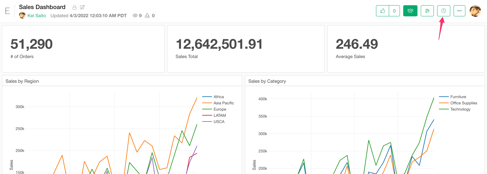
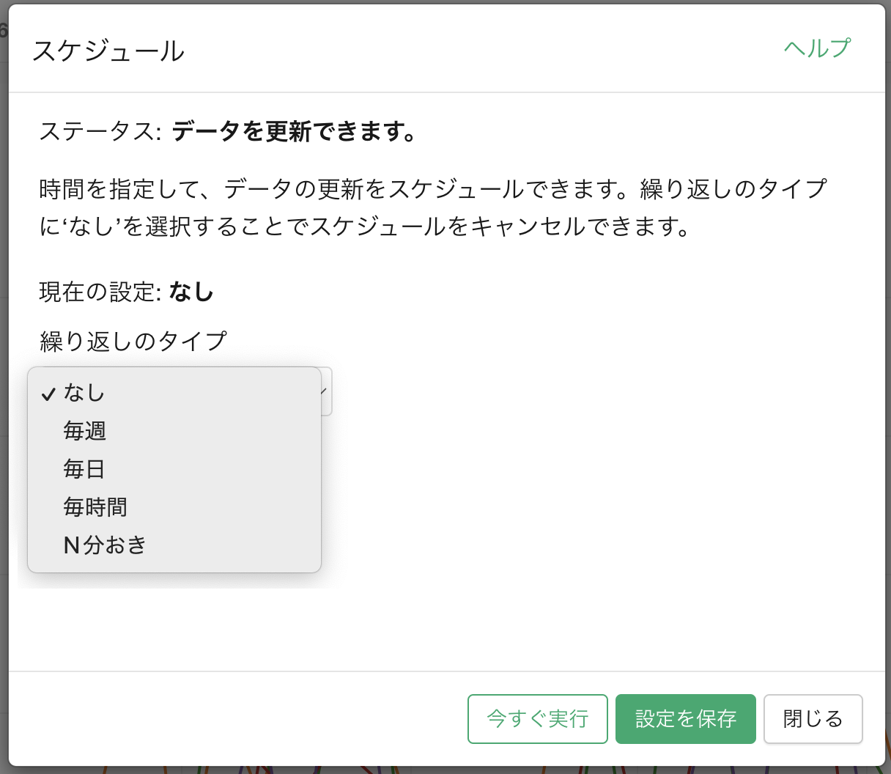
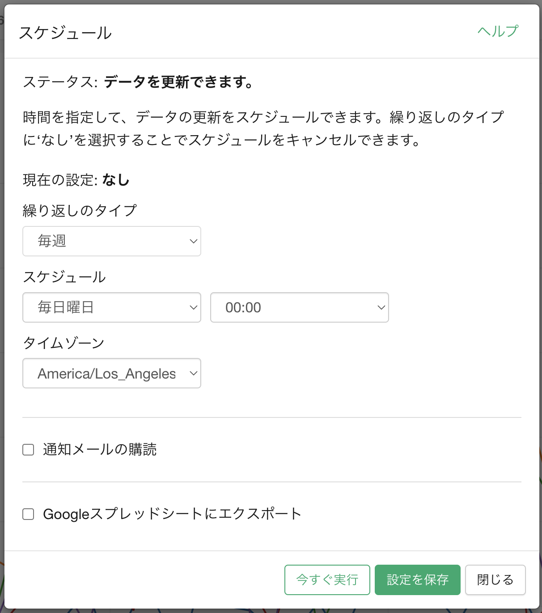
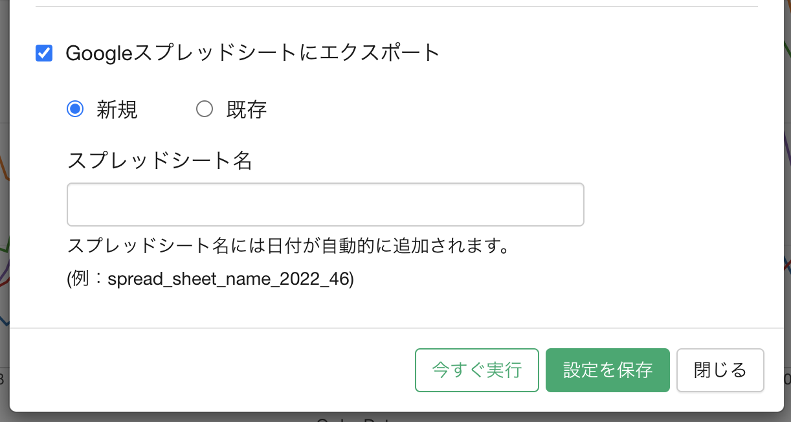
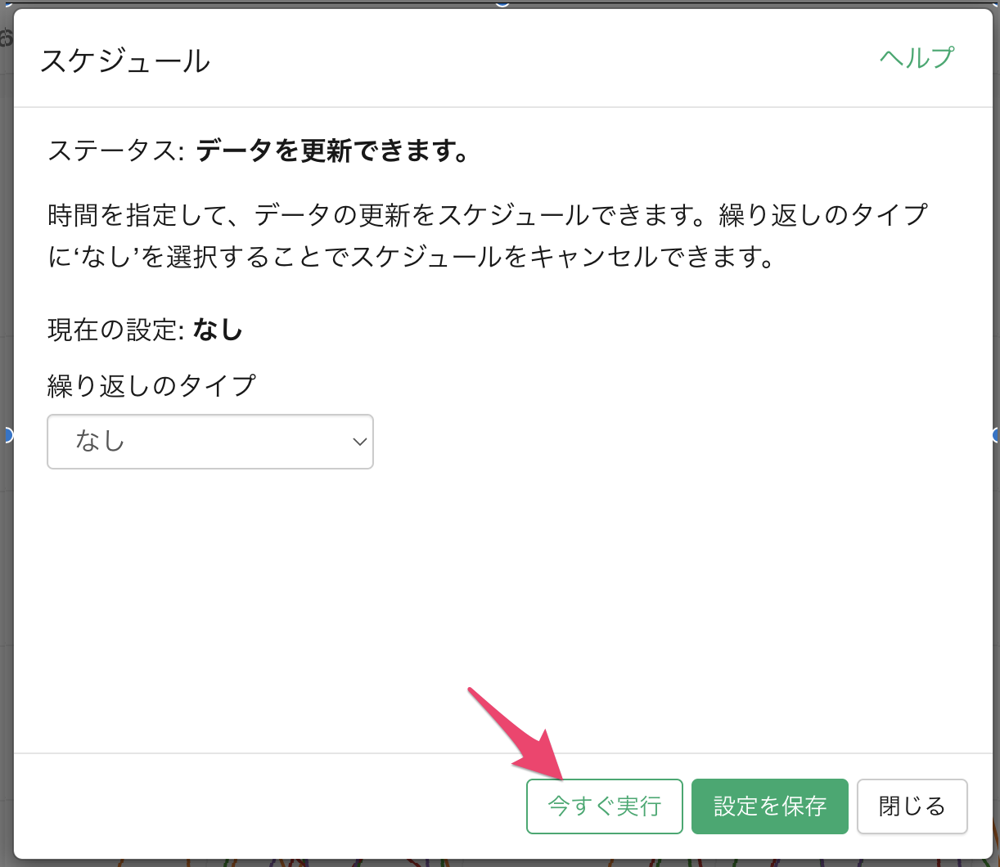

# スケジュールの管理

時計アイコンをクリックして、スケジュールを管理するためダイアログを開くことができます。

このインサイトがスケジュールを設定できない場合、時計アイコンは表示されません。一般的な理由は次のとおりです。

* データがローカルファイルから取得されている場合。スケジュールを行うためには、データはネットワークからアクセスできる必要があります。
* データソースのタイプが、スケジューリングをサポートていない場合。「Rスクリプト」データソースなど。

「繰り返しのタイプ」のドロップダウンから、スケジュールの頻度を変更できます。次のオプションが利用可能です。

* 毎週
* 毎日
* 毎時間
* N分おき（Businessプランのユーザーのみが利用可能）

繰り返しのタイプを選択すると、スケジュールの詳細が表示されます。必要に応じて設定を変更してください。

「通知メールを購読」チェックボックスをオンにすると、スケジュールの実行ごとに通知を受け取ることができます。

インサイトがデータ、チャート、アナリティクスのいずれかである場合は、更新されたデータをGoogleスプレッドシートに保存することもできます。保存方法には以下のオプションがあります。

* 新しいスプレッドシートとして保存
* 既存のスプレッドシートに新しいタブを追加
* 既存のスプレッドシートの既存のタブのデータを上書き
* 既存のスプレッドシートの既存のタブにデータを追加

設定が完了したら、「設定を保存」ボタンをクリックします。

# 今すぐ実行

繰り返しを設定せずに、ただスケジュールを1回だけ実行してデータを更新したい場合は、「今すぐ実行」ボタンをクリックします。

# スケジュールに関するよくある問題と解決法

スケジュールに関するよくある問題と解決法については、[こちら](https://exploratory.io/note/exploratory/iMN6asA6)をご覧ください。

