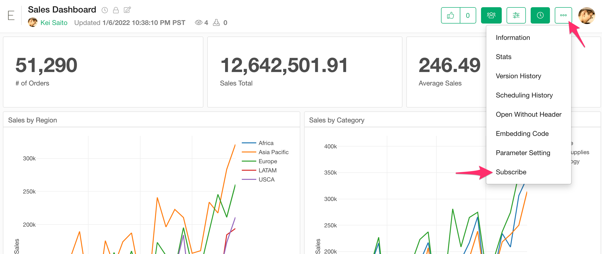
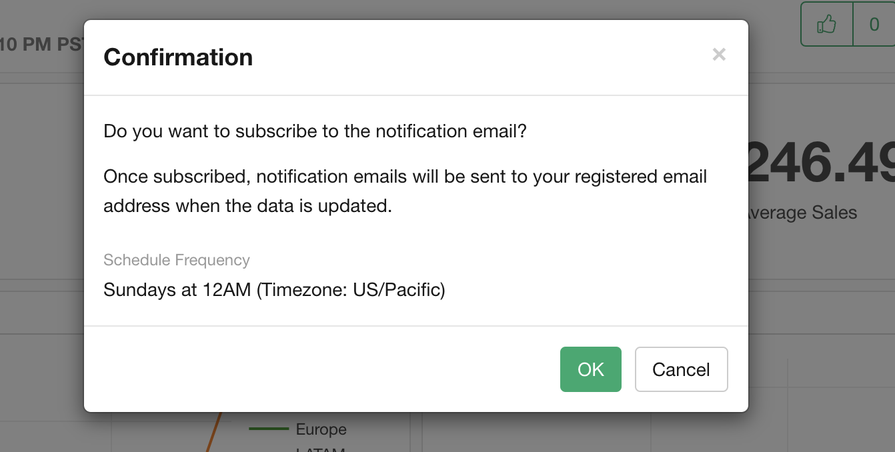
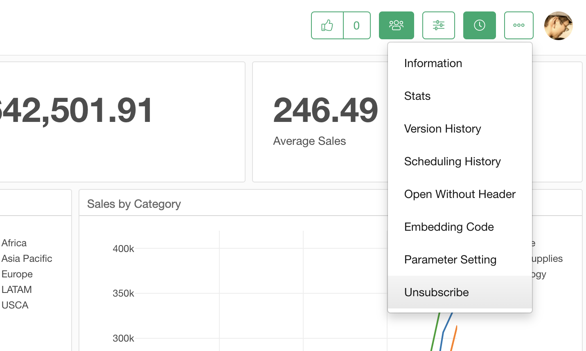

# Notification

You can receive notifications by email when the insight is updated by the scheduling. If you want to set up the notification, select the "Subscribe" from the menu.

Then the Confirmation dialog shows up. You can check the scheduling frequency here. If you want notifications, click "OK".

You can select "Unsubscribe" from the menu to stop the notification.

