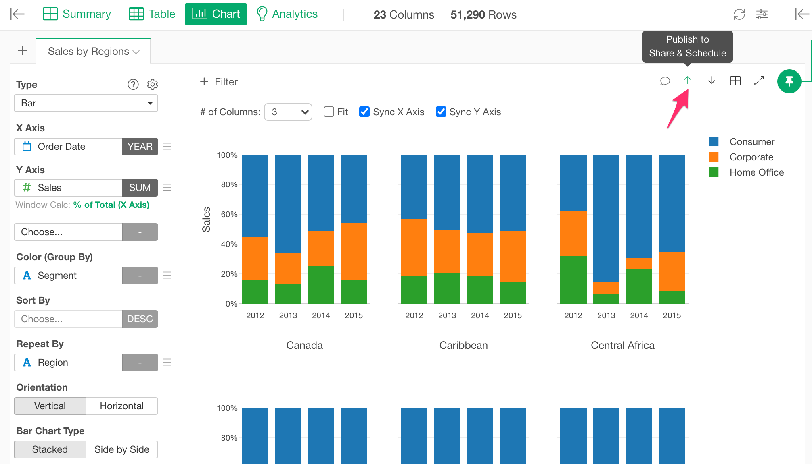
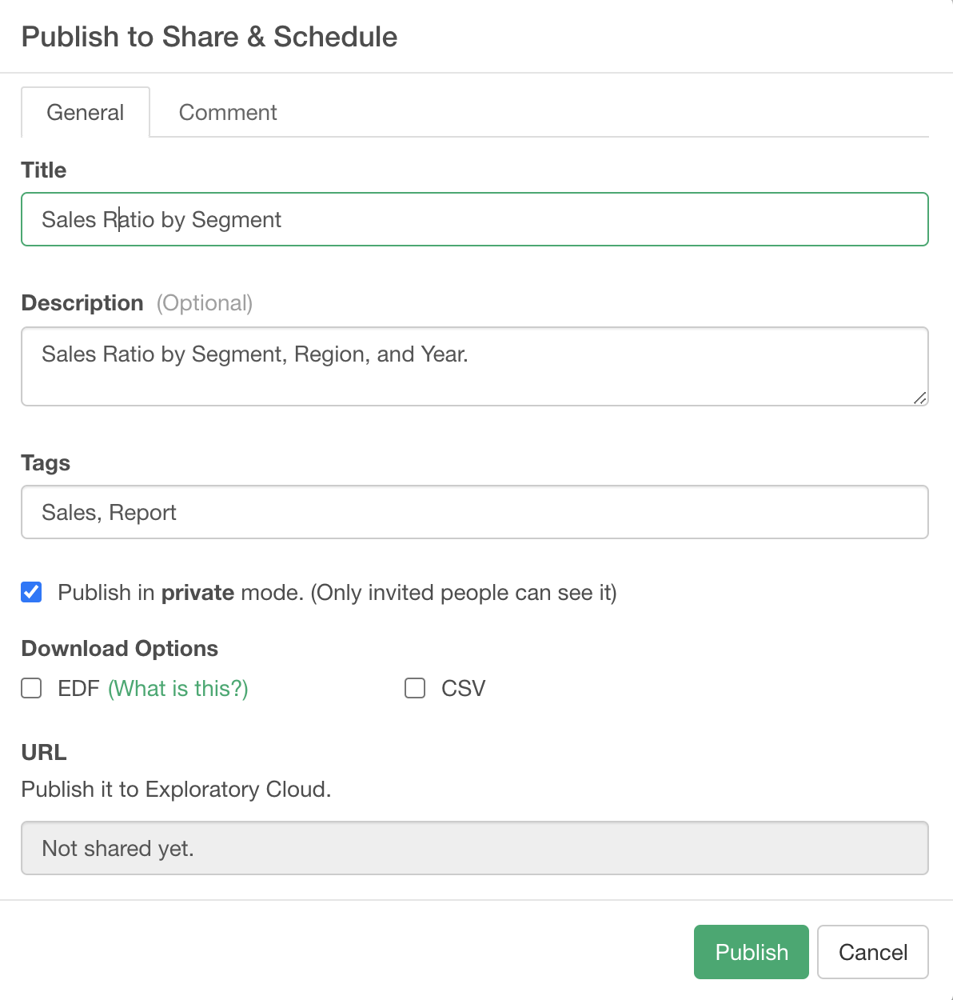
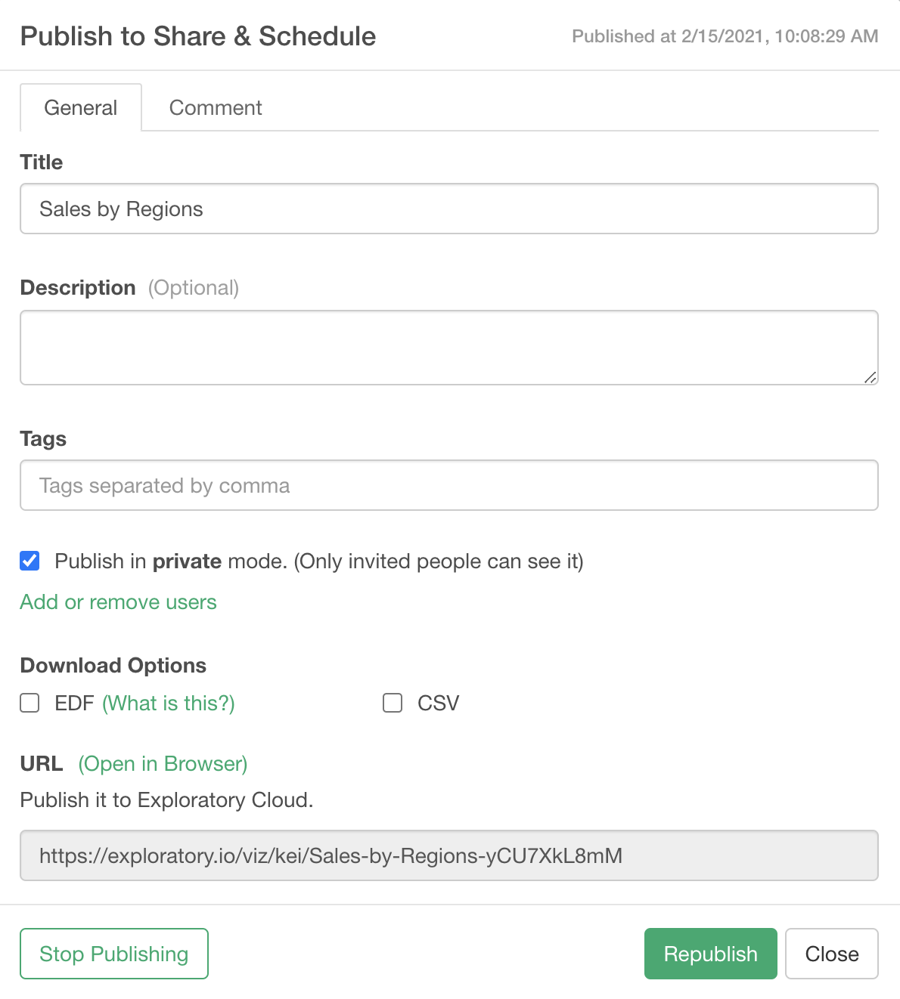

# Sharing Chart/Analytics

You can quickly share your chart or analytics you have created in Exploratory Desktop with others by simply clicking on 'Publish' button. Since not only you are sharing the chart itself but also you are sharing the underlying data and the data wrangling steps to produce the data, other people whom you share with will have much easier time to understand where the data originally came from and how it was prepared, and improve or fix the data wangling steps collaboratively. By importing the shared chart anybody can easily reproduce and validate the steps to reproduce the chart step by step.

# How to Share Chart or Analytics with Data and Steps

You can simply click 'Publish' button in the Chart or Analytics view to start sharing your data visualization.

It opens up the dialog. You can set the followings.

* Title: Title of the chart.
* Description: Description of the chart.
* Tags: Tag words separated by comma. It is useful for other people to search this chart by the keywords. 
* Publish in private mode: If you check this checkbox, this chart will be published and shared privately. Only the people that you invite can see the published chart on the server.
* Download Options
  * EDF: If you check this, it enables the EDF file download from the published chart page on the server. EDF stands for "Exploratory Data Format". It is a data exchange format between Exploratory Desktops. It includes metadata information to reproduce the data and visualizations. 
  * CSV: If you check this, it enables the CSV file download and CSV API from the published chart page on the server. 
* URL: This is a read-only field. The URL for the published chart will show up here once you publish the chart. 

Click the "Publish" button to publish it. 

You can republish or stop publishing by the buttons at the bottom of the dialog once you publish it. 

 