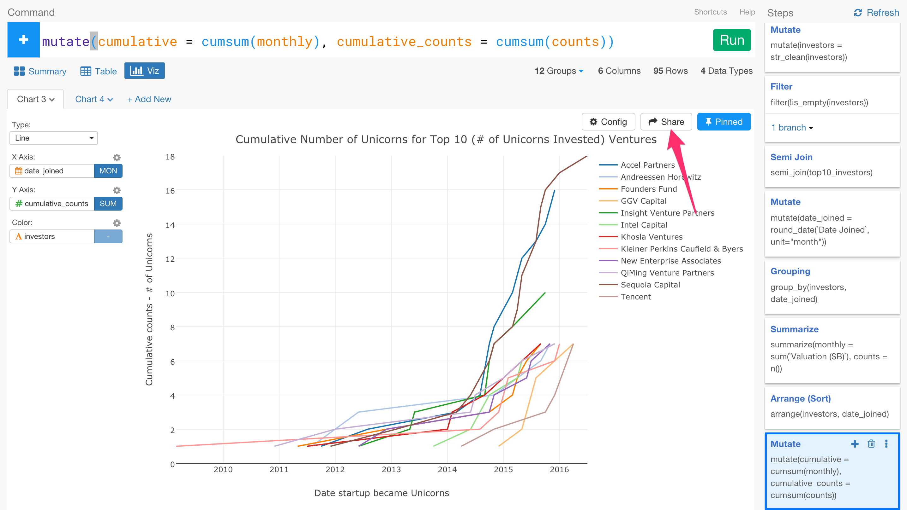

# Sharing Data Visualization

You can quickly share chart or data visualization you have created in Exploratory Desktop with others by simply clicking on 'Share' button. Since not only you are sharing the chart itself but also you are sharing the underlying data and the data wrangling steps to produce the data, other people whom you share with will have much easier time to understand where the data originally came from and how it was prepared, and improve or fix the data wangling steps collaboratively. By importing the shared chart anybody can easily reproduce and validate the steps to reproduce the chart step by step.

# How to Share Data Visualization with Data and Steps

You can simply click 'Share' button to start sharing your data visualization.

We have written a blog post that introduces the overview of the feature and walks you through how to share the charts with the data and the data wrangling steps.

* [Sharing Chart in Reproducible Way](https://blog.exploratory.io/sharing-chart-in-reproducible-way-1f03a10db486#.sehw8fnpg)
