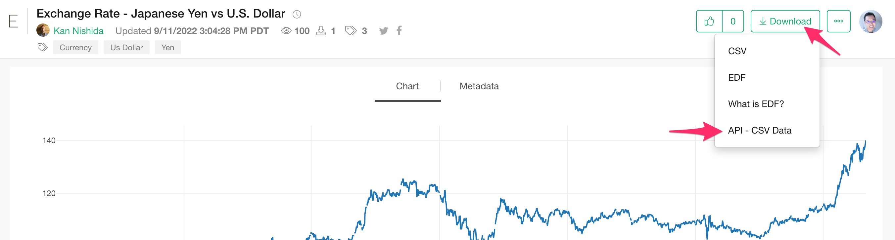
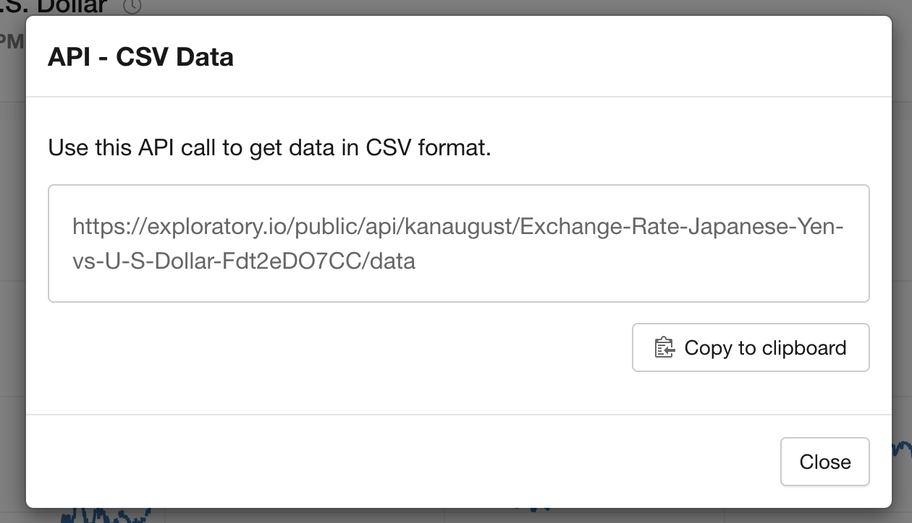

# CSV API

If you publish your insight such as Chart, Data, Analytics with the download option enabled, you can download the data from the server by using the CSV API. You can check the CSV API URL by selecting "API - CSV data" from the download button on the server insight page.

Example: https://exploratory.io/viz/kanaugust/Exchange-Rate-Japanese-Yen-vs-U-S-Dollar-Fdt2eDO7CC?lang=ja







## Specification

The API specification is following. You need the API Key only if the insight is published privately. 

```
https://exploratory.io/public/api/{User ID}/{Insight ID}/data?api_key={API Key}
```

