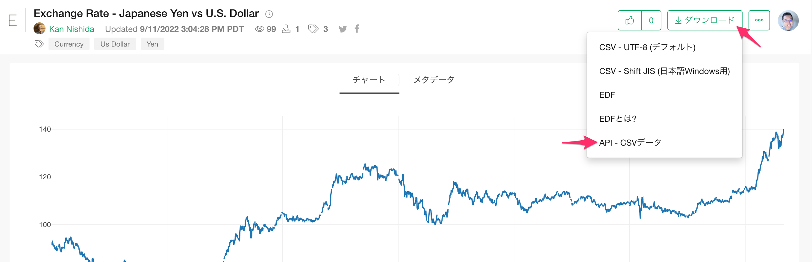
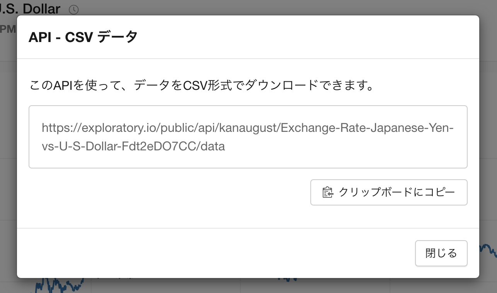

# CSV API

ダウンロードオプションを有効にしてパブリッシュされたデータ、チャート、アナリティクスなどのインサイトのデータは、CSV APIを用いてダウンロードすることができます。CSV APIのURLは、サーバのインサイトのページのダウンロードボタンから、「API - CSVデータ」を選択することで確認することができます。

例: [Exchange Rate - Japanese Yen vs U.S. Dollar](https://exploratory.io/viz/kanaugust/Exchange-Rate-Japanese-Yen-vs-U-S-Dollar-Fdt2eDO7CC?lang=ja)







## 仕様

APIの仕様は以下の通りです。APIキーは、インサイトがプライベートで共有されている場合のみ必要です。

```
https://exploratory.io/public/api/{ユーザーID}/{インサイトID}/data?api_key={APIキー}
```

