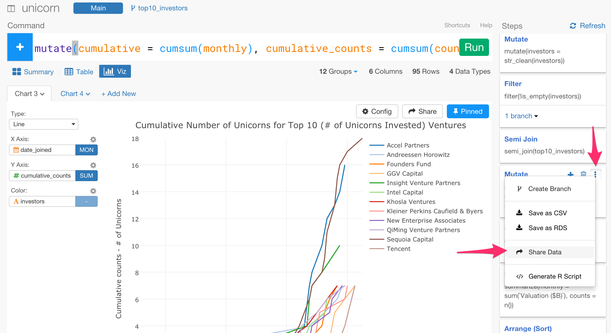

# Sharing Data

You can quickly share data you have built or transformed in Exploratory Desktop with others at any step of the data wrangling at the left hand side. Since not only you are sharing the data but also you are sharing the wrangling steps to produce the data, other people whom you share with will have much easier time to understand where the data originally came from and how it was prepared, and improve or fix the data wangling steps collaboratively. By importing the shared data anybody can easily reproduce and validate each step of the data wrangling and analysis.

# How to Share Data with Steps

You can simply select 'Share Data' menu from 'More Action' dropdown in any step of the data wrangling.

We have written a blog post that introduces the overview of the feature and walks you through how to share the data with the data wrangling steps.

* [Sharing data in a reproducible way](https://blog.exploratory.io/sharing-data-in-a-reproducible-way-f0e8d07ce431#.xtutopgwv)

# Sharing Branch Data or Joined Data

What if you want to share data that is branched off or joined with other data frames? Exploratory Desktop takes care of the data dependency automatically, so you can simply click 'Share Data' at any step to share. The shared data includes all the necessary data wangling steps and data to reproduce the data so that the imported data will have the branch or joined data frames if required. We have written a blog post that walks you through how it works in detail.

* [A few data sharing scenario worth talking about](https://blog.exploratory.io/a-few-data-sharing-scenario-worth-talking-about-97c0f8d66474#.j5hiabrnk)
