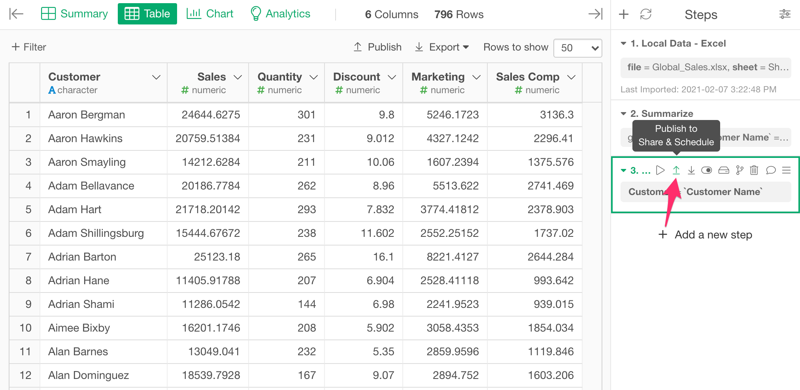
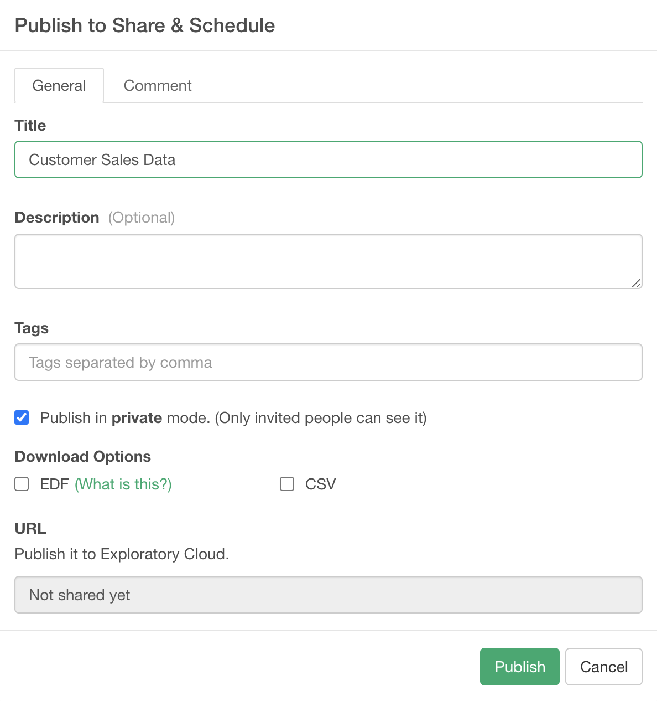
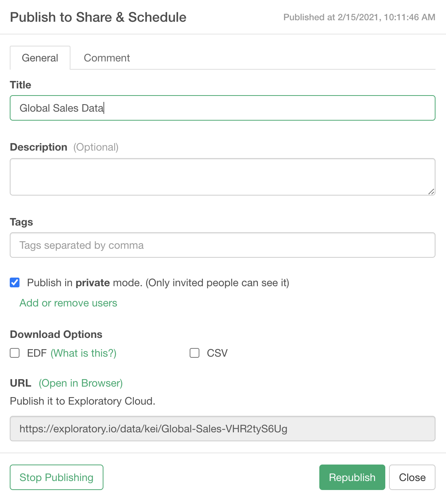

# Sharing Data

You can quickly share data you have built or transformed in Exploratory Desktop with others at any step of the data wrangling at the left hand side. Since not only you are sharing the data but also you are sharing the wrangling steps to produce the data, other people whom you share with will have much easier time to understand where the data originally came from and how it was prepared, and improve or fix the data wangling steps collaboratively. By importing the shared data anybody can easily reproduce and validate each step of the data wrangling and analysis.

# How to Share Data with Steps

You can simply click 'Publish' button in any Step. 

It opens up the dialog. You can set the followings.

* Title: Title of the data.
* Description: Description of the data.
* Tags: Tag words separated by comma. It is useful for other people to search this data by the keywords. 
* Publish in private mode: If you check this checkbox, this data will be published and shared privately. Only the people that you invite can see the published data on the server.
* Download Options
  * EDF: If you check this, it enables the EDF file download from the published data page on the server. EDF stands for "Exploratory Data Format". It is a data exchange format between Exploratory Desktops. It includes metadata information to reproduce the data. 
  * CSV: If you check this, it enables the CSV file download and CSV API from the published chart page on the server. 
* URL: This is a read-only field. The URL for the published data will show up here once you publish the data. 

Click the "Publish" button to publish it. 

You can republish or stop publishing by the buttons at the bottom of the dialog once you publish it. 

 

# Sharing Branch Data or Joined Data

What if you want to share data that is branched off or joined with other data frames? Exploratory Desktop takes care of the data dependency automatically. The shared data includes all the necessary data wangling steps and data to reproduce the data so that the imported data will have the branch or joined data frames if required. 

# Schedule 

Once you publish your data, you can setup a schedule to refresh your data periodically. See the [document](/product-features/schedule/manage) for more details about how to manage the schedule. 