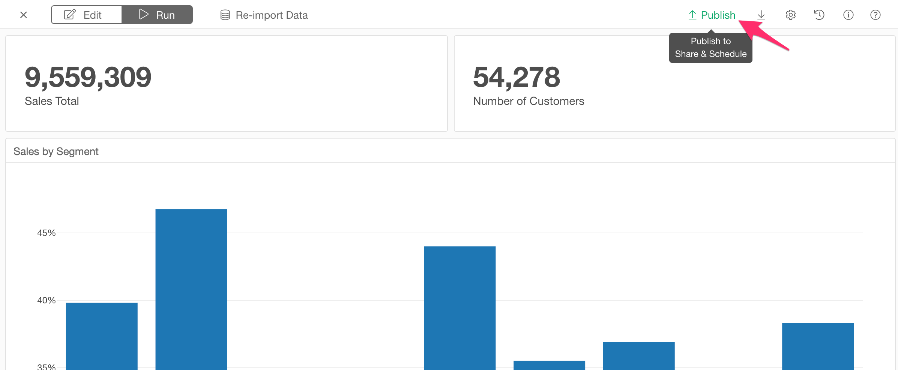

# レポート (ノート, ダッシュボード) の共有

You can simply click 'Publish' button in the report (Note, Slides or Dashboard). 

It opens up the dialog. You can set the followings.

* Title: Title of the report.
* Description: Description of the report.
* Tags: Tag words separated by comma. It is useful for other people to search this report by the keywords. 
* Publish in private mode: If you check this checkbox, this report will be published and shared privately. Only the people that you invite can see the published report on the server.
* Download Options
  * EDF: If you check this, it enables the EDF file download from the published report page on the server. EDF stands for "Exploratory Data Format". It is a data exchange format between Exploratory Desktops. It includes metadata information to reproduce the report. 
* URL: This is a read-only field. The URL for the published report will show up here once you publish your report. 

Click the "Publish" button to publish it. 

You can republish or stop publishing by the buttons at the bottom of the dialog once you publish it. 

# Schedule 

Once you publish your Note or Dashboard, you can setup a schedule to refresh your Note or Dashboard periodically. See the [document](/product-features/schedule/manage) for more details about how to manage the schedule. 