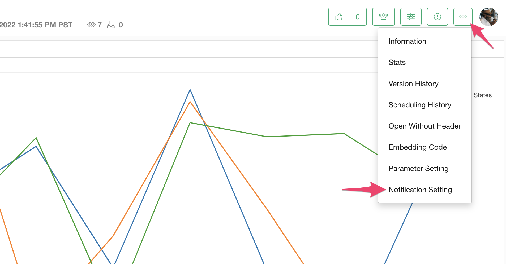
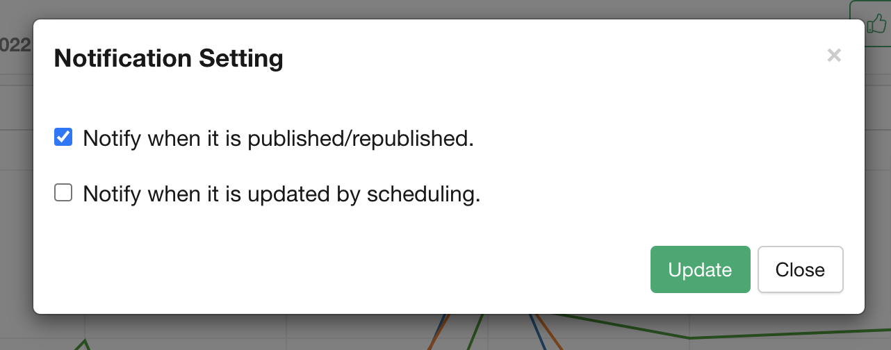

# Notification

You can set the notification for the team members if the insight is shared as a team. If you want to set up the notification, select the "Notification Setting" from the menu.

In the Notification dialog, you can set up when the notification is delivered to the team members. 

* Notify when it is published/republished.
* Notify when it is updated by scheduling.

You can click the "Update" button to update the notification setting. 

