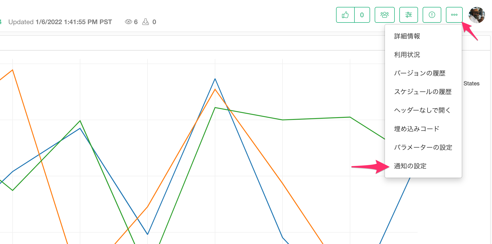
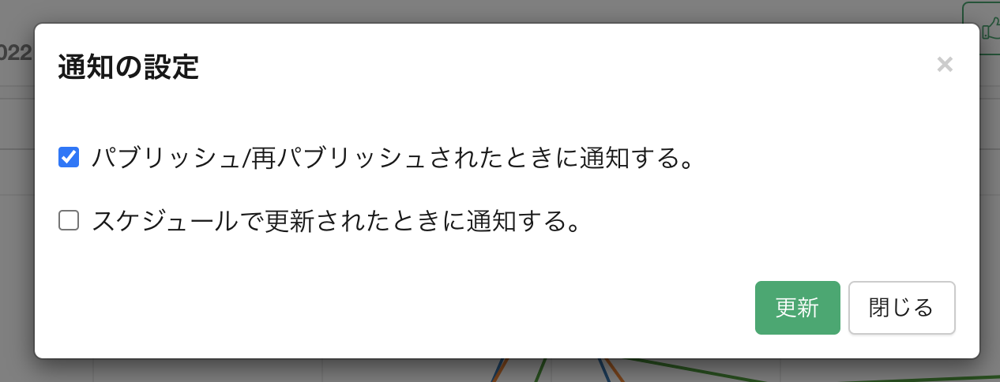

# 通知 

チームに対して共有されたインサイトは、チームのメンバーに対して通知の設定を行うことができます。通知の設定を行うには、メニューから「通知の設定」を選択します。

通知の設定のダイアログでは、どのような場合にチームのメンバーに対して通知を行うかを設定することができます。

* パブリッシュ/再パブリッシュされたときに通知する。
* スケジュールで更新されたときに通知する。 

「更新」ボタンを押すことで、通知の設定を変更することができます。

