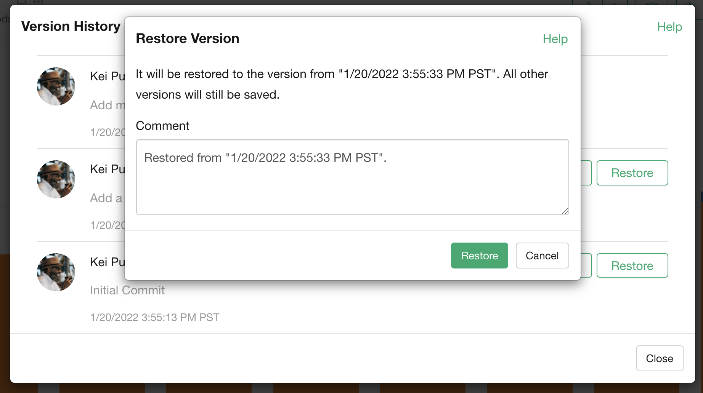

# Restore Old Version

You can restore the old version of the insight by clicking the "Restore" button in the "Version History" dialog.

If you click the "Restore" button, the confirmation dialog shows up. You can click the "Restore" button in the confirmation dialog to perform the restoring. 

The restoring process doesn't affect the existing version history. You can still access all the histories after the restoring. 

