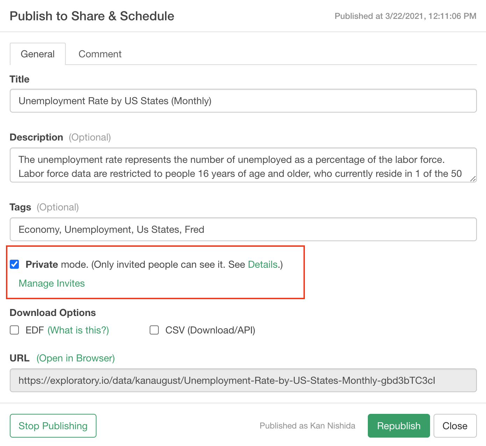
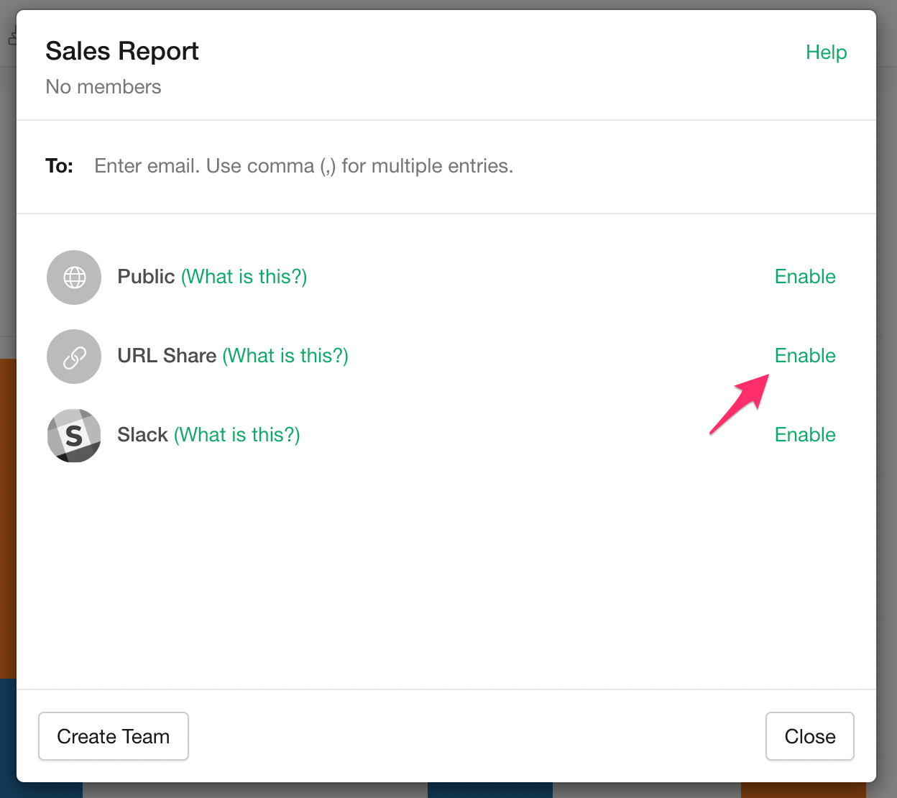
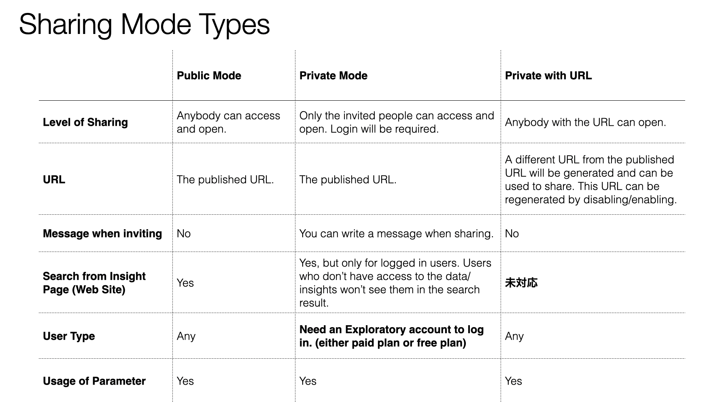

# Share Type

You can choose whether you publish data and insights in a private mode or in a public mode to share.

When you publish data or insights in the private mode you can invite others by their emails and only the ones who are invited can open the data or the insights.

Also, if you want to publish in a private mode but don't want to invite every single person you want to share with, then you can share data or insights by a special URL that is generated by clicking on 'Enable URL'.

Take a look at the table below for more details on the difference between the private mode and the public mode.

