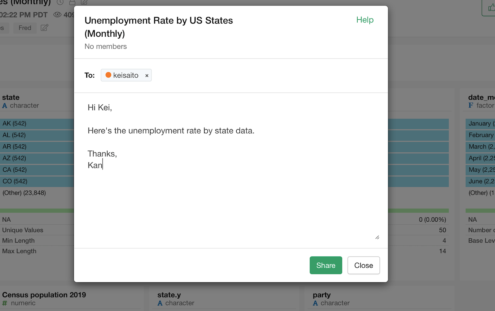
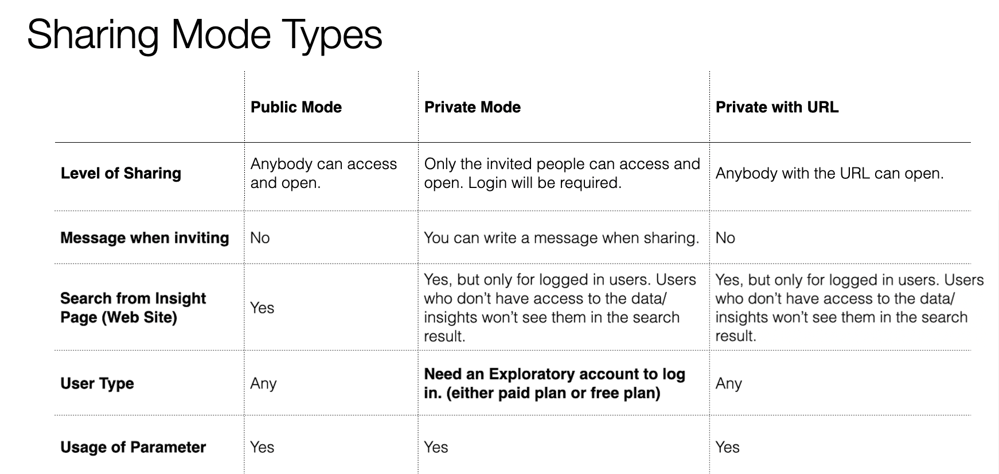

# Share Type

You can choose whether you publish data and insights in a private mode or in a public mode to share.

When you publish data or insights in the private mode you can invite others by their emails and only the ones who are invited can open the data or the insights.

You can set privileges for each invited user. The following privileges are available. 

* Can Use Parameter: If it is on, the invited user also can use the parameters if this insight has parameters.
* Can Update Share Setting: If it is on, the invited user can also invite the other users. 

Also, if you want to publish in a private mode but don't want to invite every single person you want to share with, then you can use the URL Share. By enabling the URL Share, anyone who knows the URL can access this insight without logging in. The insight is still kept private so it won't show up in the public search. 

You can change the visibility (private or public) from the Share dialog.

Take a look at the table below for more details on the difference between the private mode and the public mode.

## Backward Compatibility with the previous URL Share.

The previous URL Share using a special URL has been discontinued. You can still use the special URLs that you currently have. The special URL will be disabled and removed if you disable the URL Share from the Share dialog on the individual insight page.