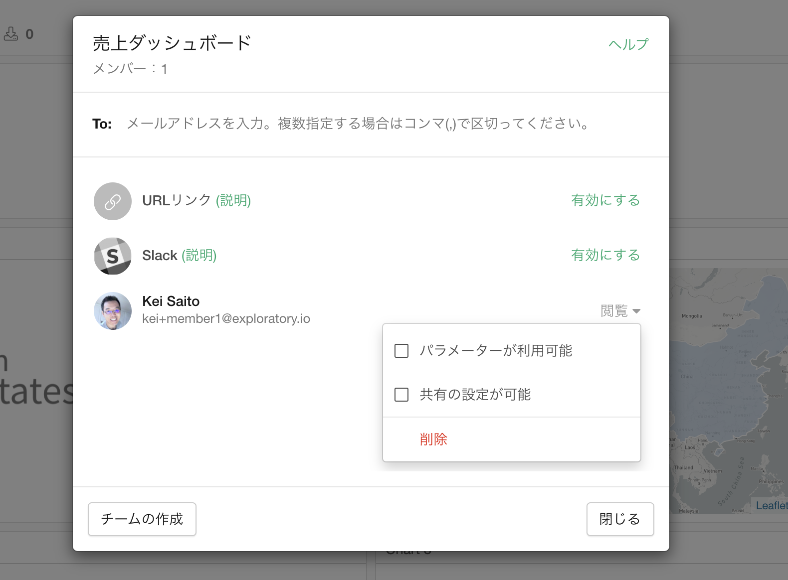
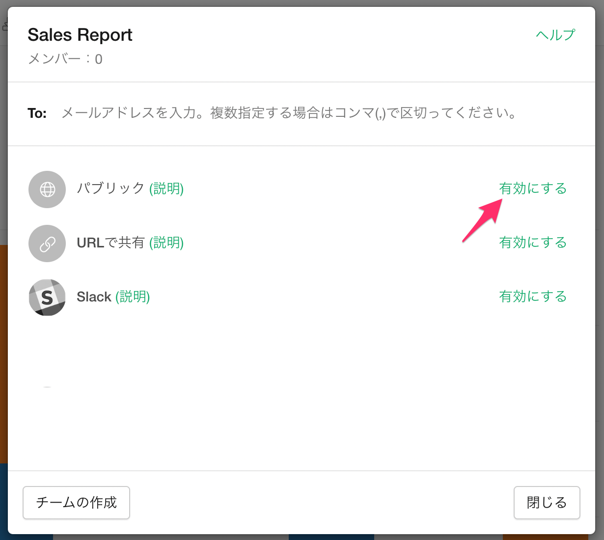

# 共有のタイプ

データやインサイトを共有する際に、プライベート・モードで共有するか、またはパブリック・モードで共有するかを選択することができます。

プライベート・モードで共有する場合には、メールアドレスを使って特定の人を招待することができ、招待した人しか見ることができません。

招待した人それぞれに対して、権限を付与することができます。付与できる権限は以下のとおりです。

* パラメーターが利用可能: データやインサイトにパラメーターがある場合、そのパラメーターを利用できるようになります。
* 共有の設定が可能: 招待された人が、さらに他の人を招待できるようになります。

また、パブリックにはしたくないが、不特定多数の人と共有したいという場合は、「URLで共有」を使うことができます。URLで共有を有効にすると、URLを知っている人は誰でもログインすることなしに閲覧をすることができます。インサイトはプライベート・モードの状態が保持されているので、検索結果には表示されることはありません。

プライベート・モードとパブリック・モードとの切り替えを、共有のダイアログから行うことができます。

プライベート・モードとパブリック・モード、さらに「URLでの共有」間の違いの詳細は以下を参照ください。

##  以前の「URLで共有」機能との互換性

共有のために特別なURL発行する、以前の「URLで共有」機能はサポートされなくなりました。現在お持ちの特別なURLは、これまで同様、引き続きご利用いただけますが、共有のダイアログから「URLで共有」を無効にすると、そのタイミングでその特別なURLは無効になり、削除されます。
