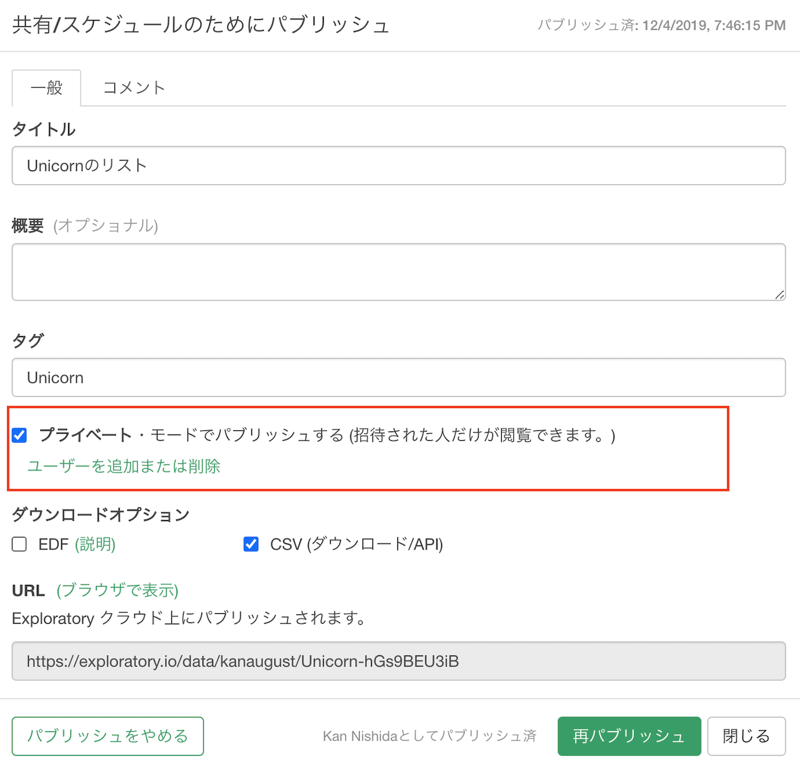
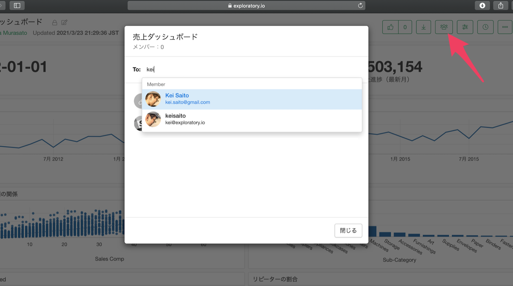
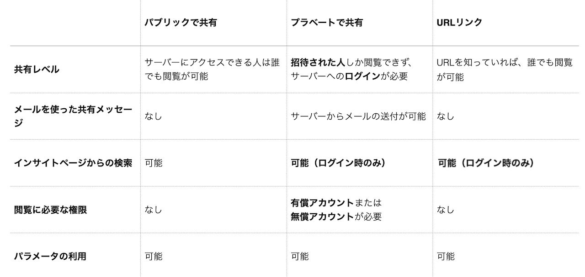

# 共有のタイプ

データやインサイトを共有する際に、プライベート・モードで共有するか、またはパブリック・モードで共有するかを選択することができます。

プライベート・モードで共有する場合には、メールアドレスを使って特定の人を招待することができ、招待した人しか見ることができません。

招待した人それぞれに対して、権限を付与することができます。付与できる権限は以下のとおりです。

* パラメーターが利用可能: データやインサイトにパラメーターがある場合、そのパラメーターを利用できるようになります。
* 共有の設定が可能: 招待された人が、さらに他の人を招待できるようになります。

また、パブリックにはしたくないが、不特定多数の人と共有したいという場合は、サーバーの「招待」のダイアログより「URLでの共有」を有効にすることができます。

プライベート・モードとパブリック・モード、さらに「URLでの共有」間の違いの詳細は以下を参照ください。

