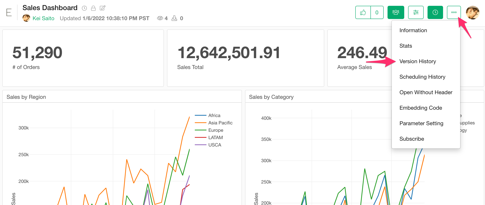
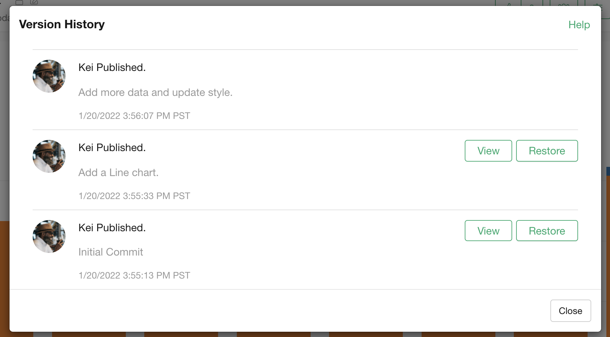

# Version History

You can check the version history from the "Version History" menu.

In the "Version History" dialog, you can check when this insight was published/republished. You can also view the screenshot image when it was published by clicking the "View" button if available. 

You can also restore the previous version. See the [Restore Old Version](restore.md) for more detail.

