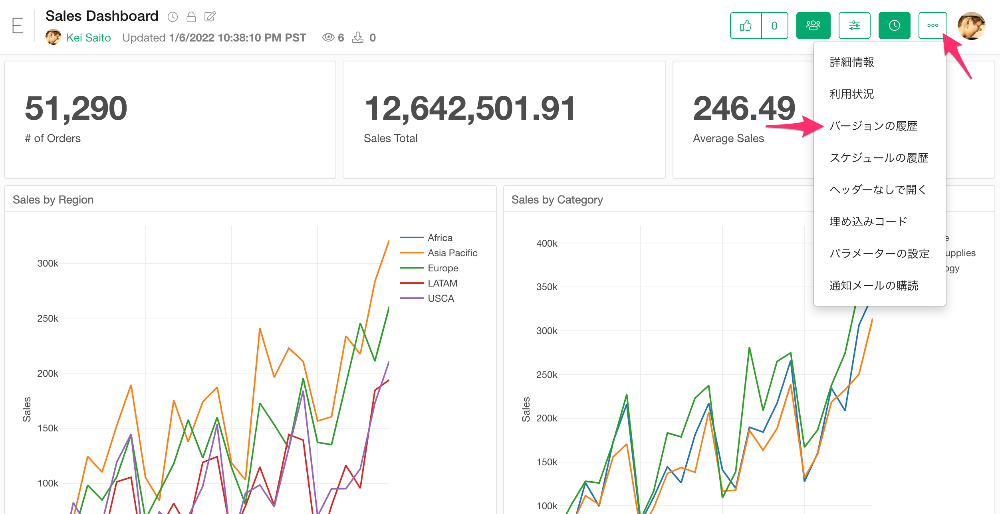

# バージョンの履歴 

「バージョンの履歴」のメニューから、これまでのスケジュールの履歴を確認することができます。

バージョンの履歴のダイアログでは、パブリッシュ/再パブリッシュされた日時や、その時のコメントを確認することができます。また、パブリッシュされたときの画像がある場合は、「見る」ボタンを押すことで確認することができます。

また、インサイトを以前のバージョンに戻すことが可能です。詳しくは[古いバージョンの復元](restore_ja.md)をご覧ください。

