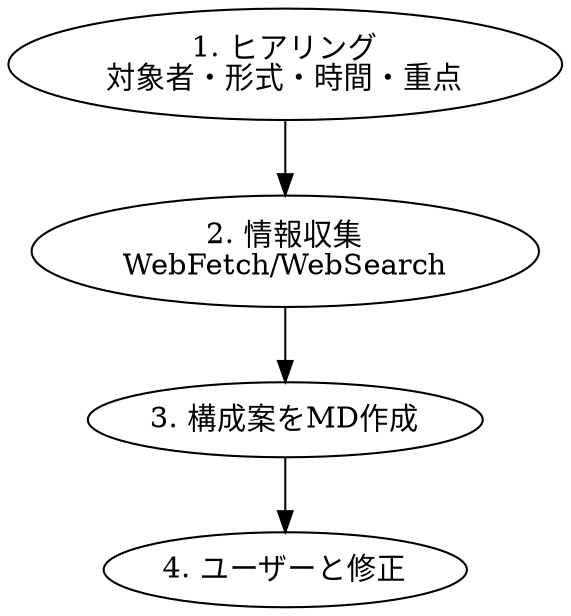

# セミナー ストーリー構成案の作成

## Overview

セミナーのテーマ・参考情報・制約条件を元に、時間配分付きのストーリー構成案をMarkdownファイルとして作成するスキル。

## When to Use

- セミナー、ワークショップ、プレゼンテーションの構成案を作りたい時
- テーマと参考URLがあり、情報を収集して構成にまとめたい時
- 「セミナーの準備をしたい」「発表のストーリーを作りたい」と言われた時

## ワークフロー



## Step 1: ヒアリング（確認事項）

以下を AskUserQuestion で確認する（ユーザーが既に提供している項目はスキップ）:

| 項目 | 質問例 |
|------|--------|
| **対象者レベル** | 基本操作は習得済み前提か、初心者も含むか |
| **発表形式** | プレゼン+デモ / スライドのみ / ワークショップ |
| **出力形式** | Markdownファイル / 会話内テキスト |
| **重点テーマ** | 特に深掘りしたいポイントがあるか |

## Step 2: 情報収集

- ユーザーが提供した**参考URL**をWebFetchで取得
- 不足情報は**WebSearch**で補完
- サブエージェント（Task tool）を活用してコンテキストを節約

## Step 3: 構成案の作成

以下の構成でMarkdownファイルを出力する:

```markdown
# [セミナータイトル] ストーリー構成案

> 対象: [対象者]
> 形式: [発表形式]
> 時間: [所要時間]

---

## 全体のストーリーライン

**核心メッセージ:** [一文で]

**ストーリーの流れ:**
1. [課題提起]
2. [解決策の全体像]
3. ...

---

## セクション構成

### 1. [セクション名]（[時間]分）

**目的:** [このセクションで達成したいこと]

#### スライド構成:
- **[スライドテーマ]**
  - [内容の箇条書き]

#### デモ（該当する場合）:
- [デモの流れ]

#### 話すポイント:
- [強調すべきこと]

---

## 想定FAQ
| 質問 | 回答 |
|------|------|

## デモの準備チェックリスト
- [ ] [準備項目]

## タイムテーブル
| 時間 | セクション | 内容 | 形式 |
|------|-----------|------|------|
```

## 構成設計の原則

| 原則 | 説明 |
|------|------|
| **課題提起ファースト** | 機能紹介ではなく、聴衆の課題・ペインポイントから入る |
| **段階的深掘り** | 概要 → 基本 → 応用 の順で進める |
| **デモ織り交ぜ** | スライド説明の直後にデモを配置し、理解を定着させる |
| **時間配分の目安** | オープニング10% / メイン70% / まとめ+Q&A 20% |
| **1セクション = 1メッセージ** | 各セクションで伝えたいことを1つに絞る |

## 時間別のセクション数目安

| 発表時間 | セクション数 | メインセクション |
|----------|-------------|-----------------|
| 15分 | 3-4 | 1-2 |
| 30分 | 4-5 | 2-3 |
| 40分 | 5-6 | 2-3 |
| 60分 | 6-8 | 3-4 |

## Common Mistakes

| ミス | 対策 |
|------|------|
| 機能の羅列になる | 課題→解決の流れを意識 |
| 時間配分が偏る | タイムテーブルを先に決める |
| デモの準備を忘れる | チェックリストを必ず含める |
| 対象者レベルを無視 | 冒頭のヒアリングで確認 |
| 参考URLの情報を鵜呑み | 複数ソースで裏取りする |
