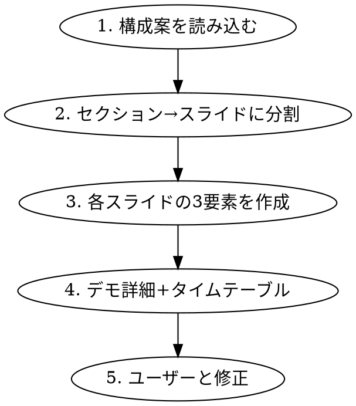

# セミナー スライド詳細の作成

## Overview

完成済みのストーリー構成案（outline）を元に、スライド1枚ごとのレイアウト構成・コンテンツ詳細・スピーカーノートをMarkdownファイルとして作成するスキル。Keynote制作にそのまま使えるレベルの詳細を出力する。

## When to Use

- ストーリー構成案（outline）が既に存在し、次のステップとしてスライド詳細を作りたい時
- 「スライドごとの詳細を作って」「Keynote用の原稿を作って」と言われた時
- outlineはあるが、各スライドのレイアウトや話す内容が未定の時

## 前提条件

- **seminar-outline** スキルで作成した構成案、またはそれに準ずるストーリー構成案が存在すること
- 構成案にセクション分け・時間配分・各セクションの内容が記載されていること

## ワークフロー



## スライド分割の目安

| セクションの時間 | スライド枚数の目安 |
|-----------------|-------------------|
| 1-2分 | 1枚 |
| 3-5分 | 1-2枚 |
| 5-10分 | 2-4枚 |
| 10分以上 | 3-5枚 + デモスライド |

デモがあるセクションは、**デモ切り替え用スライド**（デモの流れを箇条書きしたもの）を1枚追加する。

## 各スライドの3要素

すべてのスライドに以下の3要素を必ず含める:

### 1. レイアウト構成（ワイヤーフレーム）

ASCII罫線でスライドのビジュアル配置を示す。

```
┌─────────────────────────────────────────────────────┐
│ [タイトル]                                           │
├─────────────────────────────────────────────────────┤
│                                                     │
│  [左エリア: 説明]        [右エリア: ビジュアル]      │
│                          ┌──────────────┐          │
│  ・箇条書き項目1          │ [スクリーン   │          │
│  ・箇条書き項目2          │  ショット/図] │          │
│                          └──────────────┘          │
│                                                     │
│  [下部: 補足情報やポイント]                          │
│                                                     │
└─────────────────────────────────────────────────────┘
```

**レイアウトパターン:**

| パターン | 用途 |
|---------|------|
| **中央1カラム** | タイトル、ゴール、まとめ、Q&A |
| **左テキスト + 右ビジュアル** | 概念説明 + スクリーンショット |
| **2カラム比較** | Before/After、機能比較 |
| **3カラム並列** | 機能一覧、メリット一覧 |
| **上部フロー + 下部補足** | ステップ説明、仕組みの図解 |
| **グリッド（2x2, 2x3）** | カテゴリ一覧、チャートタイプ一覧 |
| **全面スクリーンショット** | デモ切り替えスライド |

### 2. コンテンツ詳細

以下を含める:

- **タイトル**: スライドの見出し（タイトル案を複数提示してもよい）
- **具体的な文言**: スライドに載せるテキストの具体的な内容
- **数字・データ**: 使用する数値やパーセンテージ
- **推奨ビジュアル**: スクリーンショット、図解、アイコンの指定
- **推奨フォントサイズ**: タイトル・本文・補足のサイズ感
- **色使い**: 強調色、Before/Afterの色分け等

### 3. スピーカーノート

- **文字数**: 1枚あたり150〜300字程度
- **話し言葉**: そのまま読める原稿として書く
- **構成**: 導入 → 本題 → 次スライドへの接続
- **デモ前**: 「では実際にデモをお見せします」等の接続句を含める
- **デモ中スライド**: デモの流れ・見せるポイント・話すセリフを含める

## 出力ファイルの構成

```markdown
# [セミナータイトル] — スライド詳細

## 発表概要
- **タイトル**: [タイトル]
- **形式**: [形式]
- **時間**: [時間]
- **対象**: [対象者]
- **キーメッセージ**: [一文]

---

## セクション1: [セクション名]（[時間]分）

---

### スライド1: [スライドタイトル]

**レイアウト構成:**
```
[ASCII ワイヤーフレーム]
```

**コンテンツ詳細:**
- **タイトル**: [具体的な文言]
- **本文**: [箇条書きや説明]
- **推奨ビジュアル**: [図解・スクリーンショットの指定]
- **色使い**: [色の指定]

**スピーカーノート:**
[150〜300字の話し言葉原稿]

---

### スライド2: ...

---

## 付録: デモの流れ詳細

### デモ1: [デモ名]（[スライドX]の後、[時間]分）
1. [手順]
2. [手順]
3. [まとめのセリフ]

---

## タイムテーブル（最終版）

| 時間 | スライド | セクション | 形式 |
|------|---------|-----------|------|
```

## スライドタイプ別テンプレート

### タイトルスライド
- レイアウト: 中央配置、メインタイトル大 + サブタイトル小 + 発表者情報下部
- タイトル 44pt以上、サブタイトル 24pt
- スピーカーノート: 挨拶 + 今日話すことの概要（100〜150字）

### 課題提起スライド
- レイアウト: 左に課題リスト + 右に数字の強調表示
- 数字は48pt以上で大きく表示
- 色: 課題部分はオレンジ〜赤系で強調
- スピーカーノート: 聴衆の共感を得る語り（250〜350字）

### 概念説明スライド
- レイアウト: 左テキスト + 右スクリーンショット/図解
- キーワードをカード形式で並べるのも効果的
- スピーカーノート: 概念の説明 + なぜ重要かの補足（200〜300字）

### Before/After比較スライド
- レイアウト: 2カラム横並び
- Before = グレー系、After = ブルー/グリーン系
- 改善率を大きく表示
- スピーカーノート: 数字のインパクトを別の単位に換算して伝える（250〜350字）

### デモ切り替えスライド
- レイアウト: 全面にデモの見どころを箇条書き
- 「デモ: [デモ名]」をタイトルに
- スピーカーノート: デモ中の実況セリフ + 見せるポイント（300〜400字）

### まとめスライド
- レイアウト: 3〜5つのキーワードをシンプルに並べる
- 番号付き or マインドマップ風
- スピーカーノート: 全体の振り返り（200〜300字）

### Q&Aスライド
- レイアウト: 極めてシンプルに「Q & A」を中央に
- スピーカーノート: 感謝 + 質問受付のセリフ（100〜150字）
- 手元に想定FAQテーブルを準備（スライドには載せない）

## Common Mistakes

| ミス | 対策 |
|------|------|
| レイアウトが全部同じ | パターンを変えて視覚的に飽きさせない |
| スピーカーノートが箇条書き | 話し言葉の原稿として書く |
| デモの流れが曖昧 | 付録にステップごとの手順を書く |
| タイムテーブルがない | 必ず分単位のタイムテーブルを付ける |
| コンテンツが抽象的 | 具体的な文言・数字・色まで指定する |
| フォントサイズ未指定 | タイトル/本文/補足のサイズ感を必ず記載 |
