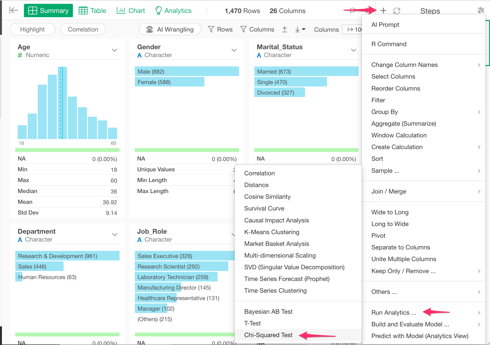
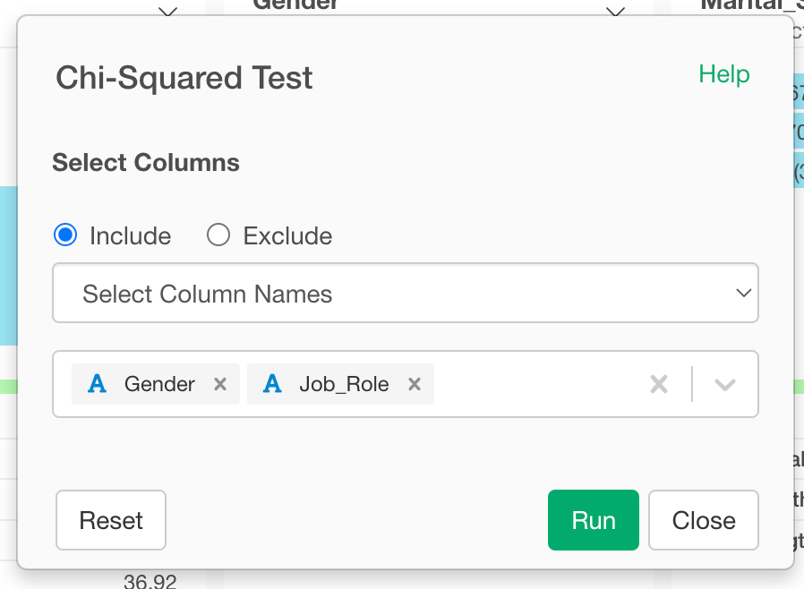

# Chi Squared Test

## Introduction

Statistical test to evaluate if distribution of variables is different among groups(columns).

## How to Access?

## How to Use?

#### Column Selection

There are many ways to select columns. You can choose
* Select Column Names - Listing up columns selecting one by one
* Range of Column Position - Select columns between columns chosen as Start and End
* Starts with - Select columns whose names start with a certain text
* Ends with - Select columns whose names end with a certain text
* Contains - Select columns whose names contain a certain text.
* Matches Regular Expression - Select columns whose names contain a certain text.
* Range of Suffix (X1, X2...) - Select columns names with prefix and numbers.
* Everything - All columns.
* All Numeric Columns - All numeric columns.

### Parameters

* Correct Continuity (Optional) - Whether continuity correction will be applied for 2 by 2 tables.
* Probability to Compare (Optional) - This works when one column is selected. A column to be considered as probability to be compared.
* Rescale Probability (Optional) - The default is TRUE. If TRUE, p is rescaled to sum to 1. If FALSE and p doesn't sum to 1, it causes an error.
* Simulate Probability (Optional) - The default is FALSE. Whether p value should be calculated by Monte Carlo simulation.
* Number of Replicates in Monte Carlo Test (B) (Optional) - The default is 2000. This works only when simulate.p.value is TRUE. The number of replicates for Monte Carlo test.

Take a look at the [reference document](https://stat.ethz.ch/R-manual/R-devel/library/stats/html/chisq.test.html) for the 'chisq.test' function from base R for more details on the parameters.

## Introduction of Chi-square test feature

* [
Exploratory v3.2 Released!](https://blog.exploratory.io/exploratory-v3-2-released-da940b794043)
