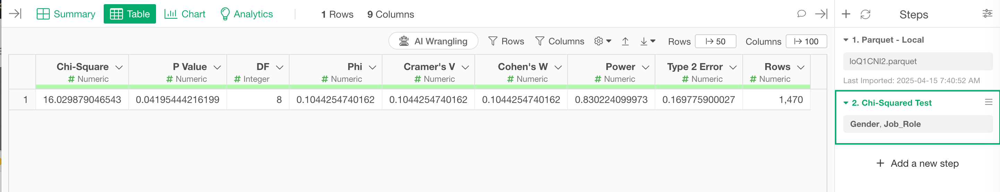

# Chi Squared Test

## Introduction

The Chi-Square Test is a statistical method used to determine whether there is a significant difference in the distribution of categorical variables between two groups (i.e., two columns).

## How to Access?

Click on the Chi-Square Test option from the step menu.

## How to Use?

#### Column Selection

In the Chi-Square Test dialog:

* Select Column Names - Choose two categorical columns from the list. These columns will be used to evaluate the distribution differences between groups.

## Output

The Chi-Square Test will output the following metrics:

### Key Statistics

| Metric | Description |
|--------|-------------|
| **Chi-Square** | indicates how much difference exists between the actual counts (number of rows) in each combination of the categories and their expected counts if there were no relationship between the two categorical variables.   P Value is calculated based on where this Chi-Square value resides on a given Chi-Square distribution.
| **P Value** | indicates a probability of observing the relationship between the two categorical variables if we accept a null hypothesis (assumption) that there is no relationship between the two.   If it is less than a threshold value you can reject the null hypothesis and conclude that there is a statistically significant difference between the two groups. Otherwise, it’s not significant. The threshold is set to 0.05 (5%) by default. |
| **DF** | Degrees of freedom represent the number of independent values that can vary in the calculation of a statistic. The degrees of freedom is calculated as (number of rows − 1) × (number of columns − 1). |
| **Rows** | Number of rows in the dataset |

### Effect Size Measurements

#### Phi Coefficient
- **Description**: Measures the strength of association between two categorical variables
- **Calculation**: √(Chi-Square / sample size)
- **Interpretation**:
  - 0.14: Large Effect
  - 0.06: Medium Effect
  - 0.01: Small Effect

#### Cramer's V
- **Description**: Cramer's V is an effect size measurement for the Chi-Square Test. It measures how strongly two categorical variables are associated.
- **Calculation**: √(Chi-Square / (min(categories) - 1) × sample size)
- **Interpretation**:
  - 0.5: Large Effect
  - 0.3: Medium Effect
  - 0.1: Small Effect
- **Note**: Interpretation may vary based on degrees of freedom

#### Cohen's W
- **Description**: Measures the strength of association between two categorical variables

### Statistical Power Analysis

| Metric | Description |
|--------|-------------|
| **Power** | Probability of correctly rejecting the null hypothesis when it is false |
| **Type 2 Error** | Probability of incorrectly accepting the null hypothesis when it is false |