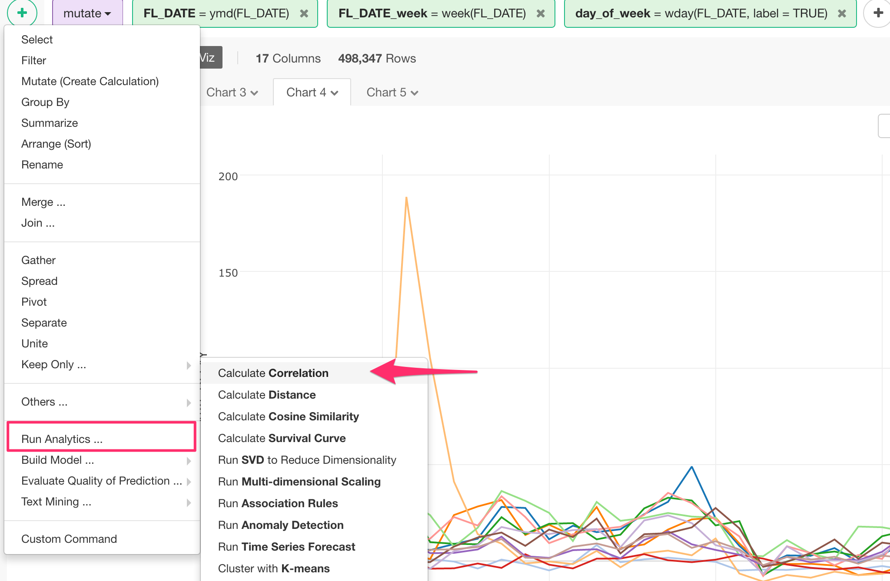
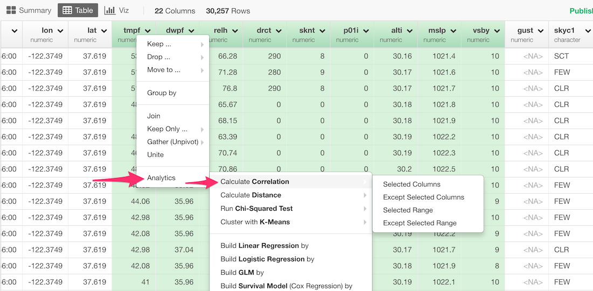
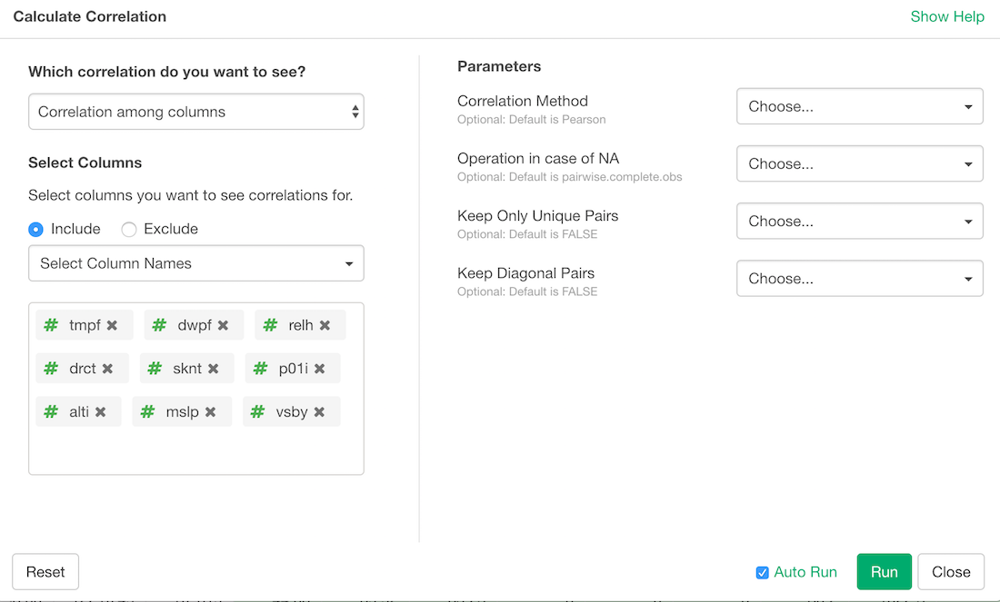
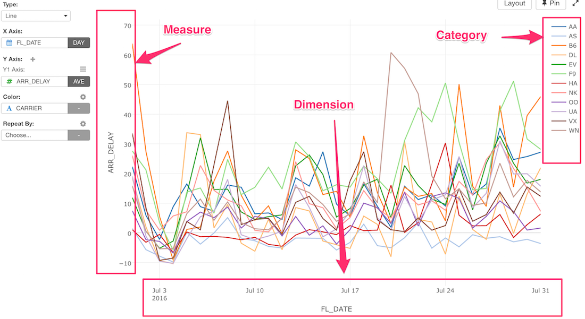
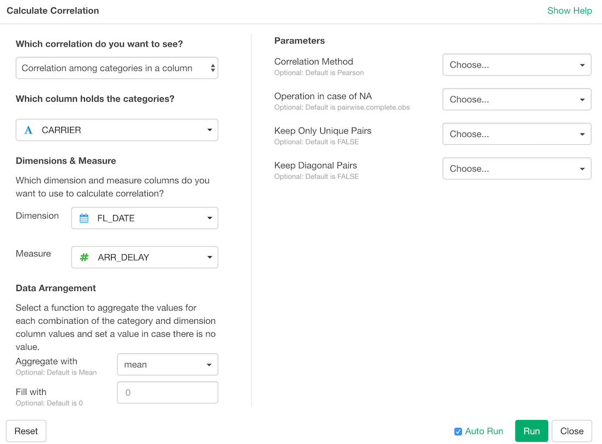

# Correlation

Here's a step-by-step tutorial guide on how to run correlation algorithm to calculate the correlation among either multiple columns or categories in Exploratory.

* [Introduction to Correlation Analysis in Exploratory](https://blog.exploratory.io/find-correlation-or-similarity-among-categories-or-variables-4813130f53c0)

## How to Access?

There are two ways to access. One is to access from 'Add' (Plus) button.

Another way is to access from the column header menu.

## How to Use?

### Calculate Correlations Among Multiple Columns (Variables)

#### Column Selection

There are many ways to select columns. You want to select Numeric data type columns here.

#### Parameters

* Correlation Method (Optional) - The default is "Pearson". This can be:
  * "pearson"
  * "kendall"
  * "spearman"
* Operation in case of NA (Optional) - The default is "pairwise.complete.obs". This can be:
  * pairwise.complete.obs
  * everything
  * all.obs
  * complete.obs
  * na.or.complete
* Keep Only Unique Pairs (Optional) - The default is FALSE. Whether the pair of output should be unique. If this is TRUE, a pair appears only once but if it's FALSE, a pair appears twice in swapped order. If you want to filter the pairs by names, it's better to be FALSE.
* Keep Diagonal Pairs (Optional) - The default is FALSE. Whether the output should contain the similarity of documents with itself.
* fill (Optional) - The default is 0. This is what should be used for missing value in groups.

Take a look at the [reference document](https://stat.ethz.ch/R-manual/R-devel/library/stats/html/cor.html) for the 'cor' function from base R for more details on the parameters.

### Calculate Correlations Among Categories

The simplest way to understand this option for calculating the correlation among the categories is to draw the data on Chart like below.

In this case, we want to understand the correlation among the airline carriers (Color) based on how their average arrival times (Y-Axis) are transitioning on the time (X-Axis). If two airline carriers move the same way, which means the two lines are 'correlated', then the correlation value for these two carriers would be high.

So, with this example, you want to select the airline carrier column to Category column, the flight date column to Dimension column, then the arrival delay column to Measure and select the aggregate function to 'Average'. This will calculate the correlation between all the pairs of the airline carriers.

#### Column Selection

* Column for Categories -
* Dimension -
* Measure -
* Aggregate Function
* Replace NA With -

#### Parameters

* Correlation Method (Optional) - The default is "Pearson". This can be:
  * "pearson"
  * "kendall"
  * "spearman"
* Operation in case of NA (Optional) - The default is "pairwise.complete.obs". This can be:
  * pairwise.complete.obs
  * everything
  * all.obs
  * complete.obs
  * na.or.complete
* Keep Only Unique Pairs (Optional) - The default is FALSE. Whether the pair of output should be unique. If this is TRUE, a pair appears only once but if it's FALSE, a pair appears twice in swapped order. If you want to filter the pairs by names, it's better to be FALSE.
* Keep Diagonal Pairs (Optional) - The default is FALSE. Whether the output should contain the similarity of documents with itself.
* fill (Optional) - The default is 0. This is what should be used for missing value in groups.

Take a look at the [reference document](https://stat.ethz.ch/R-manual/R-devel/library/stats/html/cor.html) for the 'cor' function from base R for more details on the parameters.
