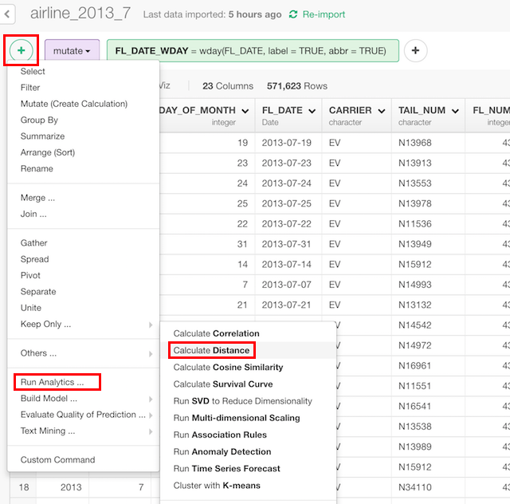
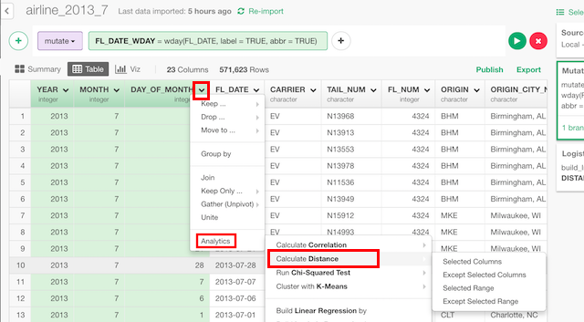
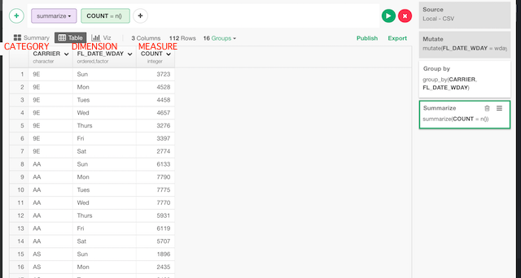
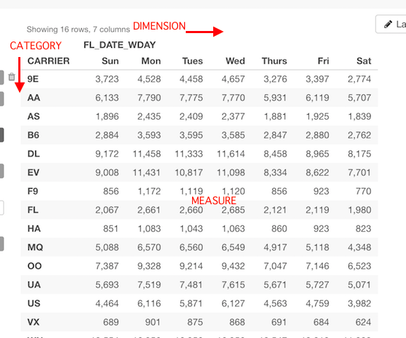

# Distance

## Introduction

Calculate distances of each of the pairs of the variables or categories. This can be used to find similarities too. The closer the distance, the more similar they are.

## How to Access?

There are two ways to access. One is to access from 'Add' (Plus) button.

Another way is to access from a column header menu.

## How to Use?

### Calculate Distances Among Multiple Columns (Variables)

#### Column Selection

There are many ways to select columns. You can choose
* Select Column Names - Listing up columns selecting one by one
* Range of Column Position - Select columns between columns chosen as Start and End
* Starts with - Select columns whose names start with a certain text
* Ends with - Select columns whose names end with a certain text
* Contains - Select columns whose names contain a certain text.
* Matches Regular Expression - Select columns whose names contain a certain text.
* Range of Suffix (X1, X2...) - Select columns names with prefix and numbers.
* Everything - All columns.
* All Numeric Columns - All numeric columns.

### Calculate Distances Among Categories

#### Column Selection

Category, dimension and measure are like this.

Category column is a column that has categories. They are parameterized by measures with the dimensions.

In this case, distances of airline carriers are calculated based on count of flight. Think that each carrier is represented as a vector with of flight count in each week day and distances of them are calculated.

If there are duplicated values or missing values for a cell, they will be aggregated by "Aggregate with" or filled by "Fill with".

### Parameters

* Distance Method (Optional) - Type of how to calculate distance. The default is "Euclidean".
  * Euclidean - The most common measurement of distance. sqrt(sum((x - y)^2))
  * Maximum - Maximum difference between elements of two vectors.
  * Manhattan - Sum of difference in each elements of two vectors.
  * Canberra - Manhattan distance weighted by the elements. sum(|x_i - y_i| / |x_i + y_i|)
  * Binary - non-zero elements are regarded as 1 and zero elements are regarded as 0. The distance is the number of elements only one is 1 divided by numbers of them at least one is 1.
  * Minkowski - This is generalized case of euclidean and manhattan. If p=2, it becomes euclidean and if p=1, it becomes manhattan. sum((x - y)^p)^(1/p)
* Keep Only Unique Pairs (Optional) - The default is FALSE. Whether the pair of output should be unique. If this is TRUE, a pair appears only once but if it's FALSE, a pair appears twice in swapped order. If you want to filter the pairs by names, it's better to be FALSE.
* Keep Diagonal Pairs (Optional) - The default is FALSE. Whether the output should contain the similarity of documents with itself.
* Output Type (Optional) - Type of output.
  * "Distance values for each pair" - Returns a pair of categories and their distance in each row.
  * "Position values in X/Y coordinates" - Returns coordinates for plot after dimension reduction by [MDS](../mds.html).

Take a look at the [reference document](https://stat.ethz.ch/R-manual/R-devel/library/stats/html/dist.html) for the 'dist' function from base R for more details on the parameters.
