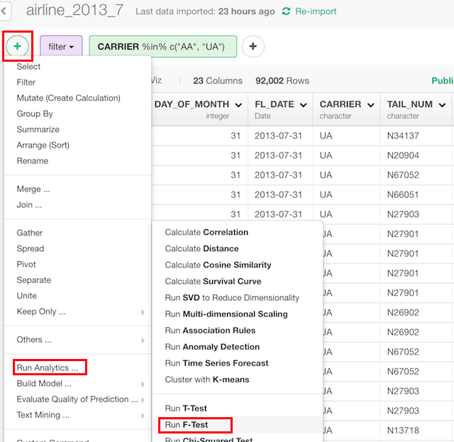

# F-test

## Introduction

Execute F-test, which checks the difference of variances between groups.

## How to Access?

You can access from 'Add' (Plus) button.

## How to Use?

#### Column Selection

* Value Column - Numeric column whose variances is calculated.
* Group Column - Label column of 2 groups.

### Parameters

* Population Variance Ratio (Optional) - The default is 1. The hypothesized population variances ratio.
* Type of Alternative Hypothesis (Optional) - The default is "two.sided". What kind of alternative hypothesis to be used. This can be
  * "two.sided"
  * "less"
  * "greater"
* Confidence Level (Optional) - The default is 0.95. The level of confidence interval.
* Subset (Optional) - a vector to specify a subset of observations to be used.
* NA Action (Optional) - The default is "na.fail". This changes the behaviour of NA data. Can be one of the following.
  * "na.omit"
  * "na.fail"
  * "na.exclude"
  * "na.pass"
  * NULL

Take a look at the [reference document](https://stat.ethz.ch/R-manual/R-devel/library/stats/html/var.test.html) for the 'var.test' function from base R for more details on the parameters.
