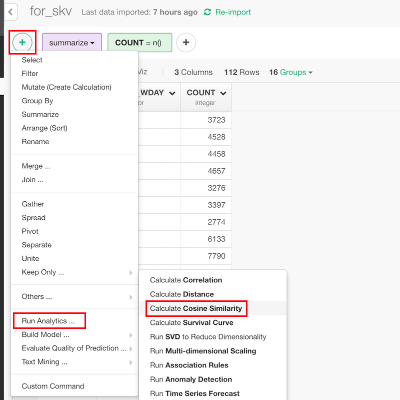
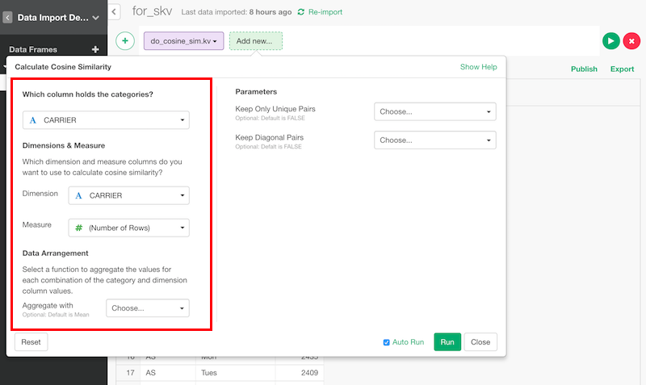

# Cosine Similarity

## Introduction

Calculate cosine similarity of each of the pairs of categories. This is often used as similarity of documents.

## How to Access?

You can access from 'Add' (Plus) button.

## How to Use?

### Calculate Distances Among Categories

#### Column Selection

Category, dimension and measure are like this.

Category column is a column that has categories. They are parameterized by measures with the dimensions.

In this case, similarities of airline carriers are calculated based on count of flight. Think that each carrier is represented as a vector of flight count in each week day and cosine similarities of them are calculated.

If there are duplicated values, they will be aggregated by "Aggregate with".

### Parameters

* Keep Only Unique Pairs (Optional) - The default is FALSE. Whether the pair of output should be unique. If this is TRUE, a pair appears only once but if it's FALSE, a pair appears twice in swapped order. If you want to filter the pairs by names, it's better to be FALSE.
* Keep Diagonal Pairs (Optional) - The default is FALSE. Whether the output should contain the similarity of documents with itself.
