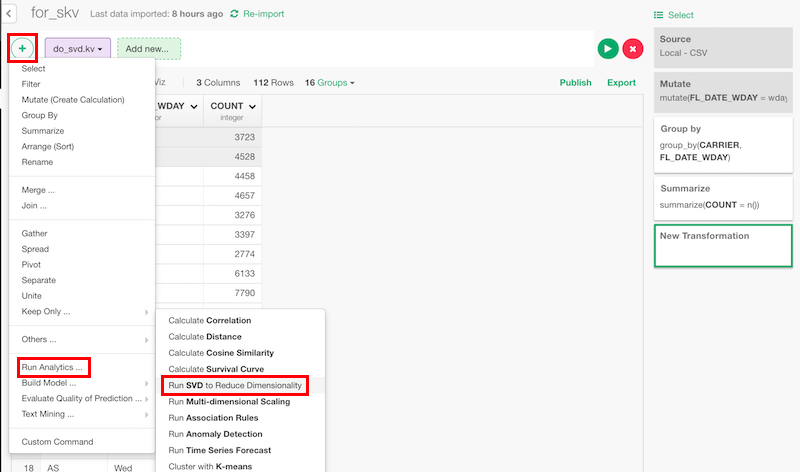
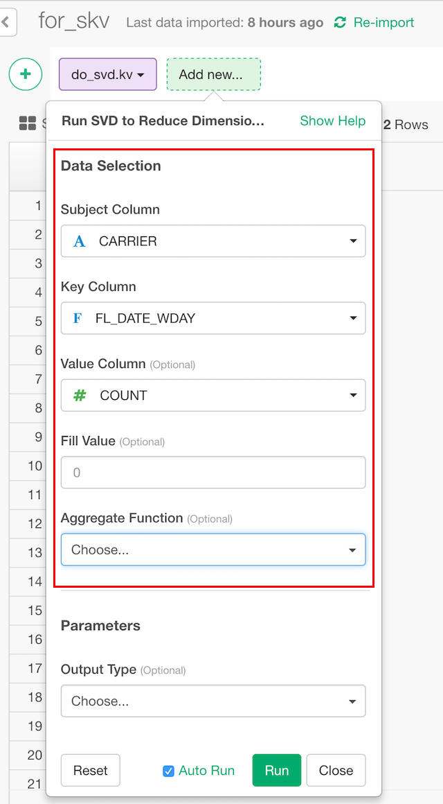

# SVD

## Introduction

Calculates coordinations by reducing dimensionality using SVD (Singular Value Decomposition).

## How to Access?

You can access from 'Add' (Plus) button.

## How to Use?

#### Column Selection

* Subject Column - Set a column to be vectorized by reduced dimensions.
* Key Column - Set a column to use as dimensions.
* Value Column (Optional) - Set a column to use as values. If empty, count of subject and key pair is used.
* Fill (Optional) - The default is 0. This is what should be used for missing value in groups.
* Aggregate Function (Optional) - The default is mean. This is how duplicated data should be aggregated.

### Parameters

* Output Type (Optional) - The default is "group".
  * "group" is to see how groups are projected to a new coordinations. This corresponds to u matrix of svd.
  * "dimension" is to see what direction the new coordinations face. This corresponds to v matrix of svd.
  * "variance" is to see how data is scattered in each of the new coordinations. This corresponds to d vector of svd. itself.
* Number of Dimensions (Optional)  - The default is 3. Set number of dimensions to reduce to. This must be less than the number of subjects and the number of keys.
* Centralize Data - The default is TRUE. Set if data should be centralized to the origin.
* Output Format (Optional) - The defualt is "wide".
 * "wide" - The components will be in columns.
 * "long" - The component will be in row.

Take a look at the [reference document](https://stat.ethz.ch/R-manual/R-devel/library/base/html/svd.html) for the 'svd' function from base R for more details on the parameters.
