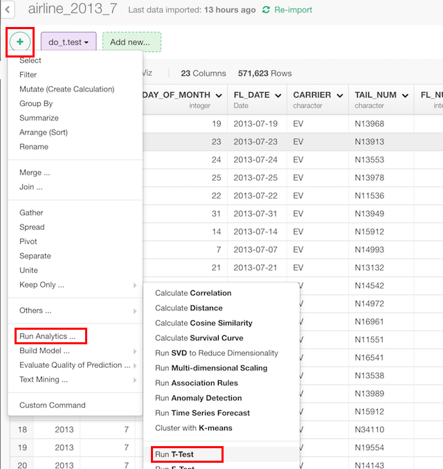
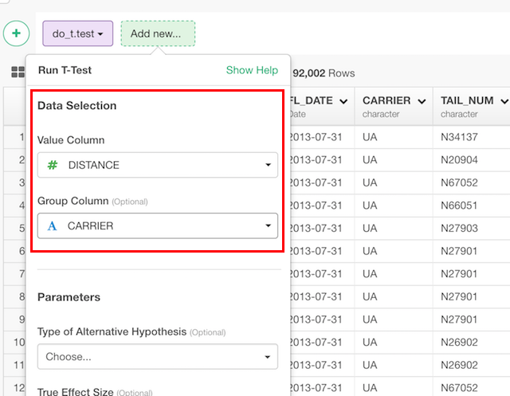

# T-test

## Introduction

Execute t-test, which checks differences of means of variables.

## How to Access?

You can access from 'Add' (Plus) button.

## How to Use?

#### Column Selection

* Value Column - Numeric column whose means should be calculated.
* Group Column (Optional) - Label column of 2 groups. Without this argument, one sample test, which compares mean with "True Effect Size" value, will be executed.

### Parameters

* The default is "two.sided". What kind of alternative hypothesis to be used. This can be
  * "two.sided"
  * "less"
  * "greater"
* True Effect Size (Optional) - The default is 0. If it's one sample test, true value of the mean. If it's two sample test, the difference in means.
* Paired (Optional) - The default is FALSE. If it should be paired t-test, which is often used to test before values and after values are different.
* Equal Variance (Optional) - The default is FALSE. If the variances of the two groups can be considered as equal.
* Confidence Level (Optional) - The default is 0.95. The level of confidence interval.
* Subset (Optional) - A vector to specify a subset of observations to be used.
* NA Action (Optional) - The default is "na.fail". This changes the behaviour of NA data. Can be one of the following.
  * "na.omit"
  * "na.fail"
  * "na.exclude"
  * "na.pass"
  * NULL

Take a look at the [reference document](https://stat.ethz.ch/R-manual/R-devel/library/stats/html/t.test.html) for the 't.test' function from base R for more details on the parameters.
