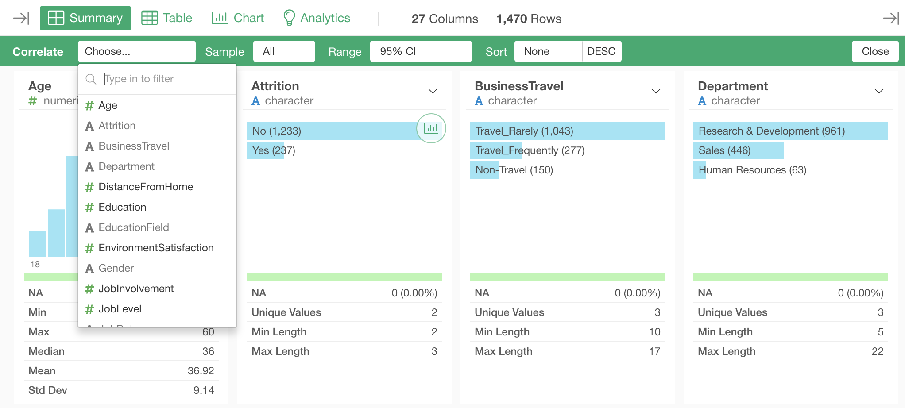
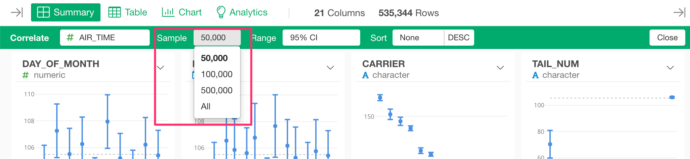

# Summary View

At the Summary View, you can view the summary information of the selected data frame. 

## Regular Mode
You can view the summary of columns in the selected data frame. 

### How to Use 

You can click "Summary" tab from the top tab menus. 

### Summary Panel

#### Header 
The header area shows the column name and its data type.

#### Column Menu
You can click the downward button to see the column menu. It shows a list of operations you can perform against this column. 

#### Chart 
The chart area shows the data distribution of this column in a bar chart. The chart type changes depending on the data type of the column.

#### Metrics
The metrics area shows the metrics of the column. It shows different metrics depending on the data type of the column.

#### Create Chart 
You can click this button to view the chart in the chart view. 

### Select Columns

You can select a column by clicking a panel. You can also choose multiple panels by Shift+Click or Control(Command)+Click. 

After selecting columns, you can open the column menu and select an operation to perform the operation to multiple columns at a time.

### Search Columns 

You can search columns by clicking the "Search" icon and entering a text to the search field. 

## Highlight Mode
In Highlight mode, you can highlight the distribution of data that you are interested in. 

### How to Use 

Click "Highlight" button in Regular mode.

Set the condition that you want highlight in the dialog. 

You can see the data that meet the condition is highlighted in Blue color in charts. 

You can click "% Ratio" to see the distribution in percentage. 

### Exit Highlight Mode
You can click "Close" button to exit the Highlight mode.

## Correlation Mode

In Correlation mode, you can see the correlations between the target column and the other columns.

### How to Use 

Click "Correlate" button in Regular mode.

Select a column that you want to see the correlations with other columns. You can choose either a numeric column or a logical column.

You can see the correlations between the target column and the other columns.

### Change Sample Size 

If your data has a lot of rows, it automatically apply the data sampling for performance. If you want to change the sample size, select the size from the "Sample" pulldown menu. 

### Change Range Type 
You can choose the range type for the error bars from "Range" pulldown menu. The options vary depending the data type of the target column.

Numeric target column: 
* 95% Conf. Interval
* 99% Conf. Interval
* 1 Standard Deviation
* 2 Standard Deviation
* 3 Standard Deviation
* Interquartile Range (IQR)

Logical target column: 
* 95% Conf. Interval
* 99% Conf. Interval

### Change Sort Order 

You can sort columns by the metric values. You can choose which metric for sorting from "Sort" pulldown menu. The options vary depending the data type of the target column.

Numeric target column: 
* R Squared
* Correlation 
* P Value 

Logical target column: 
* AUC
* P Value 

### Create Analytics/Chart 

You can create an Analytics or a Chart from the column header menu. Available Analytics and Chart types vary depending the data type of the target column and the comparing column.

#### Numeric target column 

##### Chart
* Bar 
* Error Bar
* Line 
* Scatter (Only if a comparing column is Numeric or Date)

##### Analytics
* Linear Regression 
* Decision Tree 
* Random Forest 
* XGBoost 

##### Statistical Tests
* T Test (Only if a comparing column has 2 unique values)
* ANOVA (Only if a comparing column has 2 unique values)
* Wilcoxon Test  
* Kruskal-Wallis Test 

#### Logical target column 

##### Chart
* Bar 
* Error Bar
* Line 

##### Analytics
* Logistic Regression 
* Decision Tree 
* Random Forest 
* XGBoost 

##### Statistical Tests
* Chi-Square Test 

### Create Analytics with Multiple Predictor Variables

You can create an Analytics with multiple predictor variables from Summary View by the following steps. 

* Choose columns for predictor variables by control(command)+click or shift+click. 
* Select an Analytics type from the column header menu. 

Available Analytics types vary depending the data type of the target column. 

#### Numeric target column 
* Linear Regression 
* Decision Tree 
* Random Forest 
* XGBoost 

#### Logical target column 
* Logistic Regression 
* Decision Tree 
* Random Forest 
* XGBoost 

### Exit Correlation Mode
You can click "Close" button to exit the Correlation mode.

